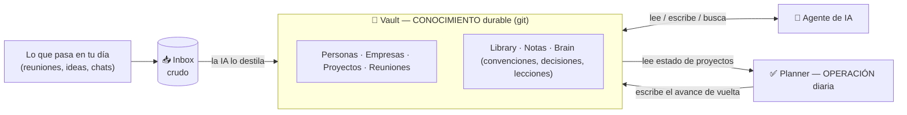
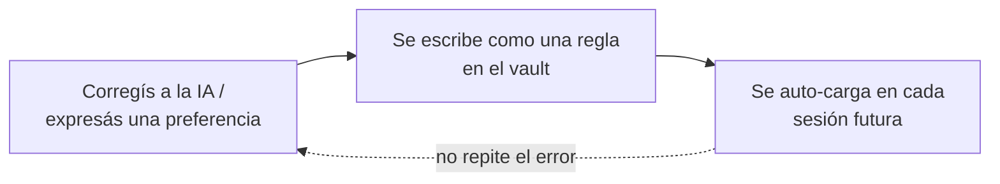

[English](README.md) · **Español**

# 🧠 The Second Brain System

> Un second brain que una IA mantiene vivo con vos — armado como una **base de datos de grafo hecha de archivos de texto plano**, gobernada por un schema explícito, que separa *lo que sabés* de *lo que tenés que hacer hoy*.

A esta altura todo el mundo sabe qué es un second brain. **Casi nadie tiene uno que funcione de verdad.**

No porque no tomen notas — por tres errores que silenciosamente pudren cualquier sistema:

0. **Le dejan a una IA armar todo de un saque.** Sin schema y sin análisis de cómo trabajan en serio, el asistente inventa estructura y conecta temas que no tienen que ver — y pasa por alto los que sí. (Una IA es buenísima *manteniendo* un sistema; es mala *inventando* el tuyo desde una hoja en blanco.)
1. **Lo tratan como un cajón de notas**, no como una base de datos. Las notas se amontonan, y seis meses después no encontrás la única cosa que necesitabas.
2. **Mezclan dos cosas distintas en el mismo lugar** — el *conocimiento* durable ("¿qué sé? ¿cómo lo sé?") y la *operación* del día a día ("¿qué tengo que hacer?"). Las tareas se meten en la referencia, la referencia se mezcla con el diario, y todo se vuelve un puré.

Este repo es el sistema que uso para evitar los tres — y la parte que casi ninguna guía cuenta: **cómo un asistente de IA lo mantiene vivo, en vez de que toda la tarea de mantenimiento caiga sobre vos.**

Es Markdown plano en un vault de [Obsidian](https://obsidian.md), versionado en git. Dos "usuarios" lo leen y escriben: **yo** (desde Obsidian) y **un agente de IA** ([Claude Code](https://www.anthropic.com/claude-code), vía un servidor MCP). Sin app propietaria, sin lock-in, sin servidor de base de datos. Solo archivos de texto y unas pocas reglas.

---

## La idea madre: conocimiento ≠ operación

La mayoría de las herramientas te obligan a elegir entre una app de notas y una de tareas, y después mirás cómo las dos se contaminan. La solución es **separarlas a propósito** y dejar que se hablen:

|  | **El Vault** (conocimiento) | **El Planner** (operación) |
|---|---|---|
| Guarda | lo **durable y conectado** | lo **operacional** |
| Responde | *qué sé · cómo lo sé · a quién conozco* | *qué tengo que hacer* |
| Ejemplos | personas, empresas, decisiones, lecciones, estado de proyectos | tareas del día, planes, logs, reviews semanales |
| Ritmo | cambia lento, **se acumula** | cambia cada día, **se archiva** |

El Vault es el hub. Todo lo durable vive ahí como un **grafo de entidades** — una nota por persona, empresa, proyecto, reunión — cableadas entre sí con links. El Planner es un lugar aparte para el ruido de la ejecución diaria — en mi caso es **[cc-life-planner](https://github.com/FacuVCanale/cc-life-planner)**, su propio repo open-source (estado en Markdown + skills de Claude Code + un visor web local para la planificación diaria por Slack). Un script chico deja que el Planner *lea* el estado de los proyectos del Vault para planificar sin duplicarlo nunca.

> **Regla de oro de todo el sistema:** *organizá por entidad, dejá que los links hagan el trabajo, y empezá simple.* No inventes estructura antes de necesitarla.

---

## Lo que lo hace distinto: el loop con IA

Un second brain vale lo que vale su mantenimiento — y el mantenimiento es justo donde la gente abandona. Por eso en este sistema **el mantenimiento se comparte con un agente de IA**. Tres cosas hacen que funcione:

- **🗂️ Un schema, no a ojo.** Un solo archivo ([`taxonomy`](docs/schema.es.md)) define cada tipo de nota, sus campos y un vocabulario *cerrado*. Es el contrato que siguen tanto el humano como la IA, así el vault se mantiene consistente en vez de degenerar en caos. Pensalo como un `schema.sql`, para tu vida.

- **📥 Captura → entidades, automático.** Lo crudo (una reunión transcripta, un chat exportado, una nota de voz) cae en un `Inbox`. Un comando y la IA lo **destila en las entidades correctas** — encuentra las personas y proyectos mencionados, los mergea con las notas que ya existen (sin duplicar nunca), archiva la reunión y vacía el inbox.

- **🔁 Aprende tus correcciones — una sola vez.** La función clave. Cuando corregís al asistente o expresás una preferencia, **la escribe como una regla** en el vault. Esas reglas se auto-cargan en cada sesión futura. Así nunca tenés que repetirte: el sistema mejora cuanto más lo usás.

Ese último loop es lo que hace que esto se sienta menos como un software de notas y más como **un cerebro que capitaliza**: conocimiento que captura, convenciones que aprende, relaciones que recuerda — todo en texto plano que es 100% tuyo.

---

## Cómo está organizado

Por **tipo de entidad**, no por proyecto ni por fecha. Cada carpeta de primer nivel es un *tipo de cosa*; la navegación la da el grafo (los links), no carpetas profundas.

| Carpeta | Qué guarda |
|---|---|
| `People/` · `Companies/` · `Projects/` · `Meetings/` | las **entidades del grafo** — los "sustantivos" de tu vida, una nota cada uno |
| `Library/` | conocimiento **reutilizable** que cualquier proyecto puede citar (modelos, papers, datasets, conceptos) |
| `Notes/` | notas atómicas sueltas (una clase, una idea) que todavía no son una entidad |
| `Brain/` | cómo trabajás *vos*: **convenciones** (auto-cargadas para la IA), **decisiones** (ADRs), **lecciones** |
| `Inbox/` → `Archive/` | captura cruda que entra, se procesa y se vacía; los originales se archivan |
| `_meta/` · `Templates/` | el schema + plantillas para que cada nota arranque correcta |

El truco que evita que `Library/` se vuelva un cajón de sastre: el conocimiento **nace local** a un proyecto y solo se **promueve** a la biblioteca compartida el día que un segundo proyecto realmente lo cita. No adivinás el reuso de antemano — dejás que se gane el lugar. ([Razonamiento completo en la guía →](docs/guia.es.md#4-las-tres-capas-de-conocimiento-técnico))

---

## Robate esto

Esto no es un producto — es un sistema que podés copiar hoy.

1. **Leé la guía** ([Español](docs/guia.es.md) · [English](docs/guide.en.md)), o descargá el PDF ([ES](docs/guia.es.pdf) · [EN](docs/guide.en.pdf)) — todo explicado carpeta por carpeta, con diagramas y recorridos de punta a punta. Cada ejemplo usa un elenco inventado, así que no hay data real en ningún lado.
2. **Agarrá el [schema](docs/schema.es.md)** — adaptá los tipos de nota y el vocabulario a tu propia vida.
3. **Agarrá las [plantillas](templates/)** — plantillas [Templater](https://github.com/SilentVoid13/Templater) listas para cada tipo de nota, así cada nota nace con la estructura correcta.
4. **Conectá la IA** — apuntá un agente con MCP al vault y dejá que el loop de arriba haga el mantenimiento.

> Las guías están exportadas de un vault de Obsidian real, así que usan `[[wikilinks]]` — son referencias internas entre notas, inofensivas para leer en GitHub.

---

## Por qué texto plano + git

Porque el mejor second brain es el que vas a seguir teniendo en diez años. Markdown se abre en cualquier editor. Git te da historial completo y un backup gratis. No hay empresa que pueda discontinuarlo, ni botón de "exportar" que vas a necesitar algún día — **ya tenés todo en tu poder**. La IA es un inquilino potente, no el dueño.

---

Hecho y mantenido por [**Facu** (@FacuVCanale](https://github.com/FacuVCanale)). Publicado bajo [MIT](LICENSE) — forkealo, robátelo, hacelo tuyo.

*Si esto te ayudó a armar un sistema que de verdad te queda, una ⭐ en el repo significa mucho.*
