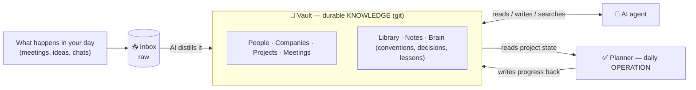
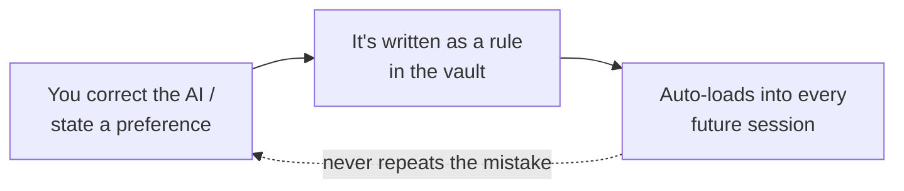

**English** · [Español](README.es.md)

# 🧠 The Second Brain System

> A second brain that an AI keeps alive with you — built as a **graph database of plain text files**, governed by an explicit schema, that separates *what you know* from *what you do today*.

Everyone knows what a second brain is by now. **Almost nobody runs one that actually works.**

Not because they don't take notes — because of two mistakes that quietly rot every system:

1. **They treat it as a drawer of notes**, not a database. Notes pile up, nothing connects, and six months later you can't find the one thing you needed.
2. **They mix two different things in one place** — durable *knowledge* ("what do I know? who do I know?") and day-to-day *operation* ("what do I do today?"). Tasks bleed into reference, reference bleeds into journaling, and the whole thing turns to mush.

This repo is the system I use to avoid both — and the part most guides skip: **how an AI assistant keeps it alive instead of you doing all the upkeep by hand.**

It's plain Markdown in an [Obsidian](https://obsidian.md) vault, versioned in git. Two "users" read and write it: **me** (from Obsidian) and **an AI agent** ([Claude Code](https://www.anthropic.com/claude-code), via an MCP server). No proprietary app, no lock-in, no database server. Just text files and a few rules.

---

## The one idea: knowledge ≠ operation

Most tools force you to choose between a note app and a to-do app, then watch the two contaminate each other. The fix is to **split them on purpose** and let them talk:

|  | **The Vault** (knowledge) | **The Planner** (operation) |
|---|---|---|
| Holds | the **durable and connected** | the **operational** |
| Answers | *what do I know? who/what do I know?* | *what do I do today?* |
| Examples | people, companies, decisions, lessons, project state | today's tasks, plans, logs, weekly reviews |
| Tempo | changes slowly, **accumulates** | changes daily, **gets archived** |

The Vault is the hub. Everything durable lives there as a **graph of entities** — one note per person, company, project, meeting — wired together with links. The Planner is a separate place for the noise of daily execution. A small script lets the Planner *read* the Vault's project state so it can plan without ever duplicating it.

> **Golden rule of the whole system:** *organize by entity, let the links do the work, and start simple.* Don't invent structure before you need it.

---

## What makes it different: the AI loop

A second brain is only as good as how well it's maintained — and maintenance is exactly where people quit. So in this system **the maintenance is shared with an AI agent**. Three things make that work:

- **🗂️ A schema, not vibes.** One file ([`taxonomy`](docs/schema.en.md)) defines every note type, its fields, and a *closed* vocabulary. It's the contract both the human and the AI follow, so the vault stays consistent instead of drifting into chaos. Think `schema.sql`, for your life.

- **📥 Capture → entities, automatically.** Raw stuff (a transcribed meeting, an exported chat, a voice note) lands in an `Inbox`. One command and the AI **distills it into the right entities** — finds the people and projects mentioned, merges them into existing notes (never duplicating), files the meeting, and empties the inbox.

- **🔁 It learns your corrections — once.** The killer feature. When you correct the assistant or state a preference, it **writes that down as a rule** in the vault. Those rules auto-load into every future session. So you never have to repeat yourself: the system gets better the more you use it.

That last loop is why this feels less like note-taking software and more like **a brain that compounds**: knowledge it captures, conventions it learns, relationships it remembers — all in plain text you fully own.

---

## How it's organized

By **entity type**, not by project or by date. Each top-level folder is a *kind of thing*; the graph (links) does the navigating, not deep folders.

| Folder | What it holds |
|---|---|
| `People/` · `Companies/` · `Projects/` · `Meetings/` | the **graph entities** — the "nouns" of your life, one note each |
| `Library/` | **reusable** knowledge any project can cite (models, papers, datasets, concepts) |
| `Notes/` | loose atomic notes (a class, an idea) not yet a full entity |
| `Brain/` | how *you* work: **conventions** (auto-loaded for the AI), **decisions** (ADRs), **lessons** |
| `Inbox/` → `Archive/` | raw capture in, processed and emptied, originals archived |
| `_meta/` · `Templates/` | the schema + note templates so every note starts correct |

The trick that keeps `Library/` from becoming a junk drawer: knowledge is **born local** to one project and only **promoted** to the shared library the day a second project actually cites it. You don't guess reuse in advance — you let it earn its place. ([Full reasoning in the guide →](docs/guide.en.md#4-the-three-layers-of-technical-knowledge))

---

## Steal this

This isn't a product — it's a system you can copy today.

1. **Read the guide** ([English](docs/guide.en.md) · [Español](docs/guia.es.md)) — the whole thing explained folder by folder, with diagrams and end-to-end walkthroughs. Every example uses an invented cast, so there's no real data anywhere.
2. **Grab the [schema](docs/schema.en.md)** — adapt the note types and vocabulary to your own life.
3. **Grab the [templates](templates/)** — drop-in [Templater](https://github.com/SilentVoid13/Templater) templates for each note type, so every note is born with the right structure.
4. **Wire up the AI** — point an MCP-capable agent at the vault and let the loop above do the upkeep.

> The guides are exported from a working Obsidian vault, so they use `[[wikilinks]]` — those are internal note references, harmless to read on GitHub.

---

## Why plain text + git

Because the best second brain is the one you'll still have in ten years. Markdown opens in any editor. Git gives you full history and a free backup. There's no company that can sunset it, no export button you'll need someday — **you already own everything**. The AI is a powerful tenant, not the landlord.

---

Built and maintained by [**Facu** (@FacuVCanale](https://github.com/FacuVCanale)). Released under [MIT](LICENSE) — fork it, steal it, make it yours.

*If this helped you build a system that actually sticks, a ⭐ on the repo means a lot.*
