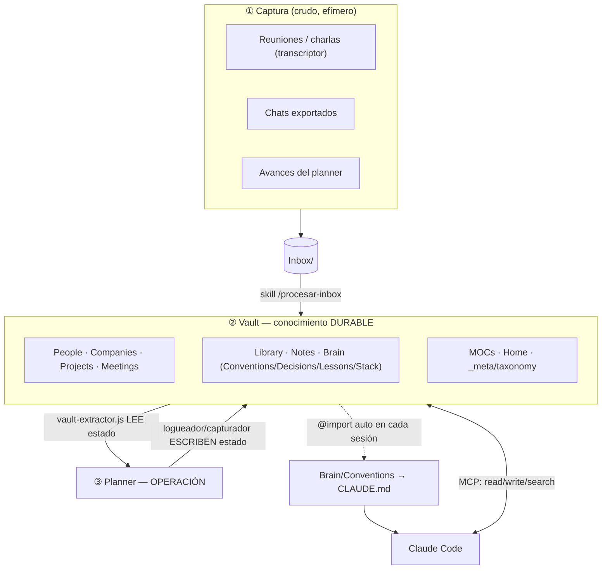
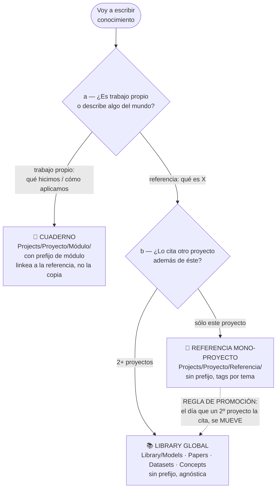
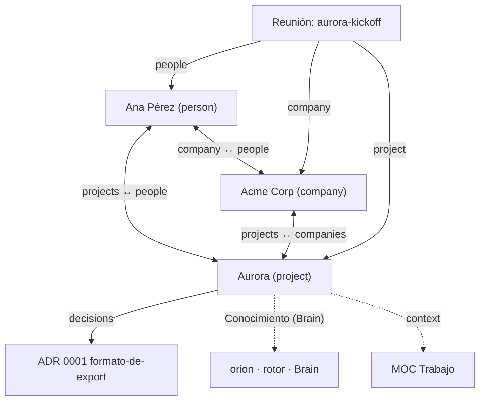
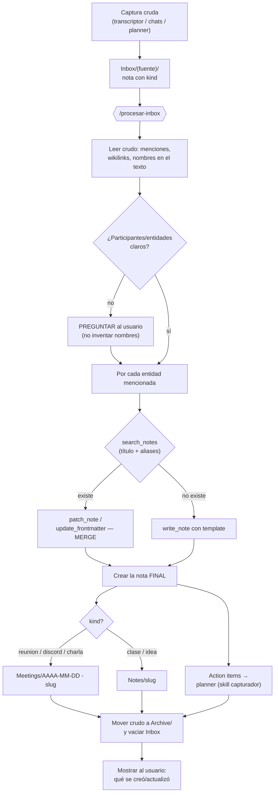
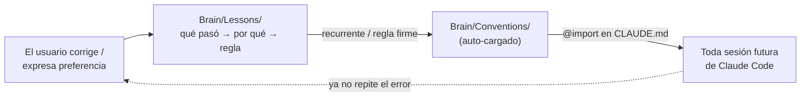
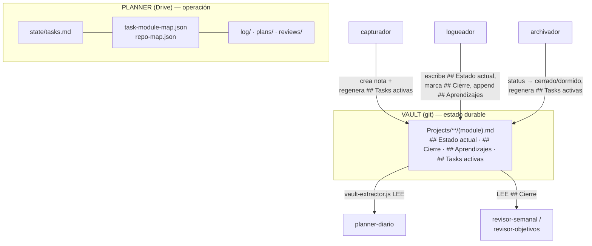
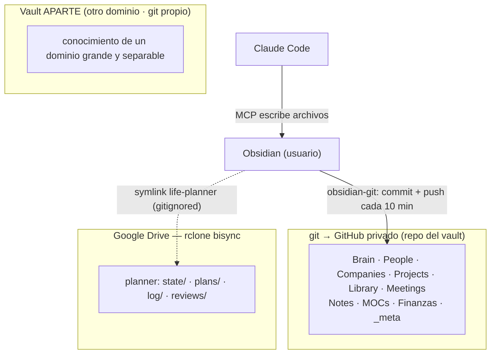

# 🧠 Guía del Second Brain

> Documentación viva de **cómo está armado** este vault: por qué existe, qué guarda cada parte, cómo se conecta con Claude Code y con el planner, y cómo se mantiene. El **contrato técnico** (schema) vive aparte en [[taxonomy]]; esta guía lo explica y lo contextualiza.
>
> Es una guía **del sistema**, no de su contenido. Todos los ejemplos usan un **elenco inventado** (nada real del vault), consistente de punta a punta: personas *Ana Pérez* y *Beto Díaz*; empresas *Acme Corp* y *Globex*; proyecto-programa *Aurora* (módulos *Backend* / *Datos* / *App*) y proyecto simple *Faro*; modelos *orion* y *rotor*; dataset *atlas*.

---

## Índice

1. [Filosofía: por qué existe y qué modelo sigue](#1-filosofía-por-qué-existe-y-qué-modelo-sigue)
2. [Vista de pájaro: arquitectura y árbol de directorios](#2-vista-de-pájaro)
3. [El contrato (schema): `taxonomy.md`](#3-el-contrato-schema-taxonomymd)
4. [Las tres capas de conocimiento técnico](#4-las-tres-capas-de-conocimiento-técnico)
5. [Recorrido carpeta por carpeta](#5-recorrido-carpeta-por-carpeta)
6. [El grafo: la red de relaciones entre entidades](#6-el-grafo-la-red-de-relaciones-entre-entidades)
7. [Obsidian: plugins y para qué sirve cada uno](#7-obsidian-plugins-y-para-qué-sirve-cada-uno)
8. [Capa de captura: del Inbox a la entidad](#8-capa-de-captura-del-inbox-a-la-entidad)
9. [Integración con Claude Code (MCP + skill + Conventions)](#9-integración-con-claude-code)
10. [Integración con el planner](#10-integración-con-el-planner)
11. [Backup y sincronización](#11-backup-y-sincronización)
12. [Flujos de punta a punta (walkthroughs)](#12-flujos-de-punta-a-punta)
13. [Reglas de oro y qué NO hacer](#13-reglas-de-oro-y-qué-no-hacer)
14. [Mantenimiento e higiene del vault](#14-mantenimiento-e-higiene-del-vault)
15. [Glosario rápido](#15-glosario-rápido)

---

## 1. Filosofía: por qué existe y qué modelo sigue

El second brain es el **hub único de conocimiento**. Es Markdown plano dentro de un vault de Obsidian, versionado en git → un repo privado de GitHub. Lo leen y escriben **dos clientes**: el humano (desde Obsidian) y Claude Code (vía un servidor MCP). No es un cajón de notas: es una **base de datos de grafo** hecha de archivos de texto, con un schema explícito.

La idea central es separar **dos naturalezas de información** que casi todos los sistemas mezclan y por eso se pudren:

| | **Vault (conocimiento)** | **Planner (operación)** |
|---|---|---|
| Guarda | lo **durable y conectado** | lo **operacional** |
| Pregunta que responde | *¿qué sé? ¿a quién/qué conozco?* | *¿qué hago hoy?* |
| Ejemplos | personas, empresas, decisiones, lecciones, estado de proyectos | tasks del día, planes, logs, reviews |
| Persistencia | git (historial completo) | Google Drive (rclone) |
| Ritmo | cambia lento, se acumula | cambia cada día, se archiva |

> **Regla de oro del sistema:** *organizá por entidad, dejá que los links (el grafo) hagan el trabajo, y empezá simple.* No inventes estructura antes de necesitarla.

El modelo es **hub + adaptadores**: el vault es el centro y se conecta con el mundo por dos puentes.

- **Entrada (captura):** lo que pasa en el día (reuniones transcriptas, avances del planner, chats) cae crudo en `Inbox/`; una skill lo **destila** a entidades del grafo.
- **Salida (extracción):** un script (`vault-extractor.js`) lee el estado de los proyectos para que el planner y otras apps **planifiquen mejor** sin duplicar la información.



---

## 2. Vista de pájaro

Estructura **por tipo de entidad** (no por proyecto ni por fecha). Cada carpeta de primer nivel es una clase de cosa; los proyectos grandes se sub-estructuran por módulo adentro de `Projects/`.

```text
~/second-brain/
├── Home.md                  ← punto de entrada (índice con vistas Dataview)
├── README.md                ← el modelo en 1 pantalla
│
├── _meta/                   ← el "esquema" del vault
│   ├── taxonomy.md          ← CONTRATO: tipos, frontmatter, vocabulario cerrado
│   ├── guia-second-brain.md ← (este documento)
│   └── Attachments/         ← imágenes/archivos embebidos
│
├── People/                  ← 1 nota por persona (global a todos los contextos)
├── Companies/               ← empresas e instituciones
├── Projects/                ← proyectos/áreas con estado (entrada del planner)
│   ├── <Proyecto-programa>/ ← proyecto grande: hub + carpeta por módulo
│   │   ├── <proyecto>.md     ← hub (type: project raíz)
│   │   ├── <Módulo-A>/  <Módulo-B>/  …   ← un módulo por carpeta (PascalCase)
│   │   └── Referencia/       ← conocimiento de dominio mono-proyecto (Models/Papers/…)
│   └── <Proyecto-simple>.md  ← proyecto chico: una sola nota
│
├── Meetings/                ← reuniones, TPs, charlas (destino de la captura)
├── Library/                 ← conocimiento REUTILIZABLE agnóstico de proyecto
│   ├── Models/  Papers/  Datasets/  Concepts/   (+ _index por sub-carpeta)
├── Notes/                   ← notas sueltas (clases, ideas que aún no son entidad)
│
├── Brain/                   ← conocimiento técnico PERSONAL (cómo construye el humano)
│   ├── Conventions/         ← AUTO-CARGADO en Claude cada sesión (workflow/testing/stack/ml)
│   ├── Decisions/           ← ADRs (decisiones de arquitectura, inmutables)
│   ├── Lessons/             ← postmortems (qué pasó → por qué → regla)
│   └── Stack/               ← una nota por tecnología (cargadas on-demand)
│
├── MOCs/                    ← Maps of Content: Trabajo · Estudio · Vida
├── Inbox/                   ← captura CRUDA → se procesa y se vacía
│   └── <fuente>/            ← una sub-carpeta por fuente de captura
├── Archive/                 ← crudo ya procesado (no se borra la fuente)
├── Finanzas/                ← carpeta de dominio propio (ej. informes periódicos)
├── Templates/               ← plantillas Templater (person, company, project, adr, meeting, note)
│
├── life-planner →  ~/code/<planner>    (SYMLINK, gitignored)
├── .obsidian/               ← config de Obsidian + plugins (parte gitignoreada)
└── .gitignore
```

**Tres ideas para leer este árbol:**

1. **Las entidades del grafo** (`People`, `Companies`, `Projects`, `Meetings`) son los "sustantivos".
2. **El conocimiento** se reparte en tres niveles de reuso (`Library` global, `Referencia` mono-proyecto, y el cuaderno dentro de cada módulo) + lo personal en `Brain`.
3. **La navegación** la dan `Home`, los `MOCs` y los wikilinks; nada se organiza "a mano" en carpetas profundas — el grafo hace el trabajo.

---

## 3. El contrato (schema): `taxonomy.md`

`_meta/taxonomy.md` es **el archivo más importante del vault**. Define el vocabulario y las reglas que tanto el humano como cualquier skill que escriba (Claude incluido) deben respetar. Claude lo lee *antes* de crear o editar una nota. Pensalo como el `schema.sql` del sistema.

### 3.1 Las reglas de oro del schema

1. **Una entidad = una nota.** Antes de crear, buscar por título + `aliases`. Si existe → **merge, no dupliques.** (Evita terminar con «Ana Pérez», «ana perez» y «A. Pérez» como tres personas distintas.)
2. **`summary` obligatorio** en toda nota (1-2 frases). Es lo que permite **previsualizar sin abrir el archivo** → controla directamente el costo de contexto del agente. Sin `summary` el agente tiene que leer la nota entera para saber si le sirve.
3. **Ante contradicción entre fuentes, marcala explícita** dentro de la nota. No sobrescribas en silencio.
4. **Relaciones por wikilink en el frontmatter** (`company: "[[Empresa]]"`). Las vistas (tablas, listas) se derivan de backlinks + Dataview, no se editan a mano.
5. **El Inbox es crudo:** se procesa y se vacía. No se borra la fuente hasta promover su contenido.
6. **Tres capas de conocimiento** con un árbol de decisión explícito (ver §4).

### 3.2 Tipos de nota (`type`)

Vocabulario **cerrado** de tipos: `person` · `company` · `project` · `meeting` · `note` · `model` · `concept` · `adr` · `lesson` · `resource` · `moc` · `meta`.

### 3.3 Vocabulario cerrado (enums)

No se inventan valores fuera de estas listas — así las vistas Dataview son consistentes:

- **`status`**: `active` · `dormido` · `cerrado` · `archived`
- **`context`**: `trabajo` · `estudio` · `vida` (puede ser lista si una entidad cruza contextos)
- **`company.relationship`**: `cliente` · `partner` · `competidor` · `institucion` · `proveedor` · `infra` · `prospecto`
- **`person.roles`**: `cliente` · `colega` · `stakeholder-cientifico` · `integrador` · `empleado` · `profesor` · `companero` · `inversor` · `contacto`
- **`meeting.kind`**: `reunion-laburo` · `discord-tp` · `charla-evento` · `clase` · `personal-idea`

### 3.4 Frontmatter por tipo (resumen)

Cada tipo tiene un frontmatter canónico (el detalle exacto está en [[taxonomy]] y en los `Templates/`). Fijate cómo los campos `company` / `people` / `projects` / `companies` son los que **tejen la red de relaciones** entre entidades (ver §6):

| Tipo | Campos clave del frontmatter | Secciones fijas del cuerpo |
|---|---|---|
| **person** | `aliases[]`, `company "[[ ]]"`, `roles[]`, `projects[]`, `context[]`, `org`, `email`, `last-contact`, `summary` | `## Notas`, `## Interacciones` (Dataview) |
| **company** | `aliases[]`, `website`, `industry`, `relationship[]`, `people[]`, `projects[]`, `context[]`, `status`, `summary` | `## Contexto`, `## Personas`, `## Proyectos` (Dataview) |
| **project** | `status`, `context`, `module` (slug del planner), `repos[]`, `people[]`, `companies[]`, `decisions[]`, `summary` | `## Estado actual` · `## Cierre` · `## Aprendizajes` · `## Conocimiento (Brain)` · `## Tasks activas` |
| **meeting** | `kind`, `date`, `people[]`, `project "[[ ]]"`, `company "[[ ]]"`, `context`, `summary` | `## TL;DR` · `## Decisiones` · `## Action items` · `## Notas` · `## Conexiones` |
| **adr** | `id`, `status`, `date`, `project "[[ ]]"`, `supersedes`, `superseded-by`, `summary` | `## Contexto` · `## Decisión` ("We will…") · `## Alternativas` · `## Consecuencias` |
| **note** | `context`, `source`, `summary` | libre + `## Conexiones` |
| **lesson** | `date`, `rule`, `area`, `summary` | qué pasó → por qué → regla |
| **model** | `family`, `learning`, `aliases[]`, `ref`, `domain`, `summary` | qué es + cómo lo uso + dónde |
| **concept** | `domain`, `aliases[]`, `ref`, `summary` | libre |
| **resource** | `kind(paper\|dataset\|snippet\|link)`, `url`, `topic`, `domain`, `summary` | libre |

### 3.5 Naming de archivos (clave para que nada se rompa)

- **Entidades** (person/company/project): **título legible** → `Ana Pérez.md`, `Acme Corp.md`, `Aurora.md`.
- **Time-based** (meeting, captura): **prefijo ISO** → `2026-02-10 - aurora-kickoff.md`.
- **ADR / conceptos sueltos**: **kebab-case** → `Brain/Decisions/0001-formato-de-export.md`.
- **Biblioteca y Referencia** (model/paper/dataset/concept): **kebab por nombre canónico, sin prefijo** → `Library/Models/orion.md`. El prefijo de módulo (`<mod>-*`, ej. `datos-*`) se reserva para el **cuaderno**.

> ⚠️ **`module` slug = basename del archivo.** El extractor del planner identifica la nota-proyecto por su nombre de archivo, no por su carpeta. Por eso **mover una nota a una subcarpeta es seguro** (los wikilinks en Obsidian resuelven por nombre, no por ruta), pero **renombrar el archivo NO**: rompe los `[[wikilinks]]` y el vínculo `module ↔ repo ↔ task` del planner.

---

## 4. Las tres capas de conocimiento técnico

Esta es la regla más sutil del vault (regla 6 de [[taxonomy]]) y la que evita que la `Library/` se convierta en un basurero. Antes de escribir conocimiento, se hacen **dos preguntas separadas**:

- **(a) Naturaleza:** ¿la nota describe algo del mundo que existe *independientemente del proyecto* (*"qué es X"*), o es trabajo/estado/decisión propia (*"qué hicimos / cómo aplicamos X"*)?
- **(b) Reuso:** si es *"qué es X"*, ¿lo citaría **algún proyecto distinto del actual**, o **sólo éste**?



**Cómo se ve en la práctica:**

- **Cuaderno** → `Projects/Aurora/Datos/datos-notas.md` (config, números y estado del trabajo propio en Aurora).
- **Referencia mono-proyecto** → `Projects/Aurora/Referencia/Models/rotor.md` (qué es *rotor*; hoy lo usa sólo Aurora).
- **Library global** → `Library/Models/orion.md` (qué es *orion*; lo citan Aurora *y* Faro → ya se promovió).

> **El error a evitar:** meter algo en `Library/` sólo porque "existe en el mundo". Si todavía lo usa un solo proyecto, va a `Referencia/`. La regla de promoción es la misma que `Lessons → Conventions`: **nace local y se promueve cuando el reuso se materializa**, no antes. No adivines el futuro.

La carpeta `Referencia/` de un proyecto-programa **espeja la estructura de `Library/`** (`Models/`, `Papers/`, `Datasets/`, `Concepts/`, `Standards/`, `Tools/`) para que promover una nota sea literalmente un `mv` sin reorganizar nada.

---

## 5. Recorrido carpeta por carpeta

### 5.1 `People/` — personas (una nota global por persona)

Una nota por persona, **única aunque cruce contextos** (un cliente que también es amigo es una sola nota con `context: [trabajo, vida]`). El nombre del archivo es el nombre legible.

Frontmatter típico (ejemplo inventado, *Ana Pérez*):

```yaml
type: person
aliases: ["Ana P.", "ana perez"]
company: "[[Acme Corp]]"          # ← relación persona → empresa
roles: [cliente, stakeholder-cientifico]
projects: ["[[Aurora]]"]           # ← relación persona → proyecto
context: [trabajo]
org: "Acme Corp — área de Datos"
last-contact: 2026-02-10
summary: "Sponsor de Aurora en Acme Corp; define requisitos y aprueba entregables."
tags: [person]
```

El cuerpo no es un volcado de datos: es **por qué importa esa persona** y el contexto que el agente necesita para retomar la relación sin re-investigar (qué se habló, qué se le debe, qué decidió). En la nota de *Ana*, por ejemplo, irían sus pedidos abiertos, qué aprobó y qué quedó pendiente con ella.

La sección `## Interacciones` es una **vista Dataview automática** que lista cada `meeting` donde la persona aparece en `people[]` — no se mantiene a mano.

### 5.2 `Companies/` — empresas e instituciones

Empresas, clientes, competidores, instituciones. Frontmatter con `relationship[]` (del vocabulario cerrado), `people[]` y `projects[]` por wikilink. El cuerpo funciona como **memoria viva** de la relación (estado del deal, presupuesto, players, próximos pasos) que sobrevive entre reuniones.

Ejemplo inventado (*Acme Corp*), mostrando la **vuelta** de los links de Ana y Aurora:

```yaml
type: company
relationship: [cliente]
people: ["[[Ana Pérez]]", "[[Beto Díaz]]"]   # ← empresa → personas
projects: ["[[Aurora]]"]                       # ← empresa → proyectos
context: [trabajo]
status: active
summary: "Cliente ancla de Aurora; sponsor del lado de Datos."
tags: [company]
```

Las secciones `## Personas` y `## Proyectos` son Dataview: listan automáticamente toda persona cuyo `company` apunta a *Acme Corp*, y todo proyecto que la tenga en `companies[]`.

### 5.3 `Projects/` — proyectos/áreas con estado (¡la entrada del planner!)

Es la carpeta más rica y la **única que el planner lee y escribe**. Una nota-proyecto conecta el trabajo con **las personas y empresas involucradas** (campos `people[]`, ej. *Ana Pérez*, y `companies[]`, ej. *Acme Corp*), con **sus decisiones** (`decisions[]` → ADRs) y con **el conocimiento técnico** (`## Conocimiento (Brain)`). Dos formas:

**(a) Proyecto simple** → una sola nota en `Projects/Faro.md`.

**(b) Proyecto-programa** (varios módulos, ej. *Aurora*) → se sub-estructura:

```text
Projects/Aurora/
├── aurora.md                 ← el HUB (type: project raíz; lista módulos, gente, empresas)
├── Datos/
│   ├── aurora-datos.md       ← nota-módulo (type: project, module: aurora-datos)
│   ├── datos-notas.md        ← cuaderno (prefijo de módulo): config, decisiones del trabajo
│   ├── datos-experimentos.md ← cuaderno: comparativa con números
│   └── datos-bitacora.md     ← cuaderno: problemas, soluciones, estado
├── Backend/ · App/           ← un módulo por carpeta (PascalCase)
└── Referencia/               ← conocimiento de dominio mono-proyecto (Models/Papers/Datasets/…)
```

Las **secciones fijas** de toda nota-proyecto son el contrato con el planner:

- **`## Estado actual`** — snapshot vivo, sin fechas. Lo mantiene el *logueador* del planner.
- **`## Cierre`** — checklist del mínimo funcional para cerrar. El planner lo lee para priorizar hacia el cierre y no hacia features (anti scope-creep). **No inflar con cosas fuera del mínimo.**
- **`## Aprendizajes`** — append, sólo señal alta. Se promueven a `Brain/Lessons` o a un ADR.
- **`## Conocimiento (Brain)`** — links *one-way* a `Brain/` y a la `Library/`.
- **`## Tasks activas`** — vista derivada de `state/tasks.md` del planner. **No editar a mano.**

> El `module:` del frontmatter es el **pegamento** entre el vault y el planner: vincula `task ↔ nota-proyecto ↔ repo`. Ver §10.

### 5.4 `Meetings/` — reuniones, TPs, charlas (destino de la captura)

Una nota por interacción, nombre con prefijo ISO (ej. `2026-02-10 - aurora-kickoff.md`). Es el **destino principal de las capturas procesadas**. Estructura: `## TL;DR`, `## Decisiones`, `## Action items` (checkboxes), `## Notas`, `## Quotes`, `## Conexiones`. El frontmatter linkea a `people[]`, `project` y `company`, así que la reunión aparece automáticamente en la vista `## Interacciones` de cada persona y en el grafo del proyecto. Una reunión es el nodo que **conecta de un saque** a las personas, la empresa y el proyecto.

### 5.5 `Library/` — conocimiento reutilizable agnóstico de proyecto

Lo que **existe independientemente de un proyecto** y más de uno puede citar. Cuatro sub-carpetas, cada una con su `_index.md` (un MOC que es a la vez explicación y vista Dataview):

- **`Models/`** — modelos/arquitecturas/algoritmos. Clasificados por `family` (classic-ml / deep-nn / process-based / hybrid) × `learning` (supervised / self-supervised / …). Cada nota: *qué es + cómo lo prefiero usar + dónde lo uso*. La config y resultados concretos viven en el cuaderno del proyecto, **no acá**.
- **`Papers/`** — papers (`kind: paper`, con `year`, `domain`).
- **`Datasets/`** — fuentes de datos (`kind: dataset`); el `_index` trae una tabla "qué es / cuándo / gotcha".
- **`Concepts/`** — conceptos de dominio reutilizables.

El `_index.md` de cada sub-carpeta no es decorativo: combina una **tabla curada a mano** (para decidir sin abrir cada nota) con una **vista Dataview** que se llena sola.

### 5.6 `Notes/` — notas sueltas

Conocimiento atómico que todavía **no es una entidad de biblioteca**: una clase, una charla, una idea. Si una nota suelta madura y la empieza a citar un proyecto, se promueve a `Library/` o a una `Referencia/`.

### 5.7 `Brain/` — conocimiento técnico personal

Cómo construye el humano, separado en cuatro:

- **`Conventions/`** — **se auto-carga en Claude en cada sesión** (vía `~/.claude/CLAUDE.md`). Son las reglas de trabajo (`workflow.md`, `testing.md`, `stack.md`, `ml.md`…), unidas por `_index.md`. Por eso se mantiene **corto y de alta señal**: cada línea cuesta tokens en *todas* las sesiones.
- **`Decisions/`** — ADRs (Architecture Decision Records). Prospectivos e **inmutables**: documentan *por qué* se eligió algo. Si la decisión cambia, se crea **otro** ADR y se marca `superseded-by`; no se edita el viejo.
- **`Lessons/`** — postmortems retrospectivos: **qué pasó → por qué → la regla**. Cuando una lección se vuelve recurrente, se **promueve** a `Conventions/`.
- **`Stack/`** — una nota por tecnología (cargadas on-demand cuando se trabaja con esa tecnología).

> **ADR ≠ Lesson:** el ADR es prospectivo ("vamos a hacer X porque…"), la Lesson es retrospectiva ("aprendimos Y cuando algo salió mal"). La Lesson se *linkea* al ADR, no lo reemplaza.

### 5.8 `MOCs/` — Maps of Content

Tres mapas por **contexto de vida**: [[Trabajo]], [[Estudio]], [[Vida]]. Cada uno es casi puro Dataview: lista los proyectos, empresas y personas de ese contexto. Son la "portada" de cada área. Cuando un dominio crece mucho y es separable (p. ej. material académico de toda una carrera), conviene moverlo a un **vault aparte** y dejar acá sólo lo *en curso* (ver §11).

### 5.9 `Inbox/`, `Archive/`, `Finanzas/`, `Templates/`, `_meta/`

- **`Inbox/`** — captura cruda, una sub-carpeta por fuente (`Inbox/<fuente>/`). Se procesa y **se vacía**.
- **`Archive/`** — el crudo ya procesado (no se borra la fuente original; se mueve acá).
- **`Finanzas/`** — carpeta de dominio propio: informes periódicos (ej. trimestrales). Vive en el vault por ser conocimiento durable; es un ejemplo de **carpeta de dominio** fuera de las entidades del grafo.
- **`Templates/`** — plantillas Templater (`person`, `company`, `project`, `adr`, `meeting`, `note`): arrancan la nota con el frontmatter correcto y las secciones fijas.
- **`_meta/`** — el schema ([[taxonomy]]), esta guía, y `Attachments/`.

---

## 6. El grafo: la red de relaciones entre entidades

El vault **no se navega por carpetas**, se navega por el grafo. Tres mecanismos:

1. **Wikilinks en el frontmatter** (`company: "[[Empresa]]"`, `people: ["[[Persona]]"]`). Crean aristas **tipadas** entre entidades. En Obsidian resuelven por **nombre de archivo**, no por ruta → por eso mover archivos entre carpetas es seguro.
2. **Dataview** — consultas tipo SQL embebidas en las notas que producen tablas/listas vivas (ej., en `Home`: *todos los proyectos activos por contexto*). Las vistas nunca se editan a mano; se derivan del frontmatter.
3. **MOCs + backlinks** — los `MOCs/` y `Home` son los puntos de entrada curados; los **backlinks** de Obsidian dan la navegación inversa gratis (quién apunta a esta nota).

### La red de relaciones (lo importante)

Las entidades se referencian **en ambos sentidos**: un Proyecto lista sus personas y empresas; esas personas listan su empresa y sus proyectos; esa empresa lista sus personas y proyectos. Es una **malla recíproca**, no un árbol. Una Reunión, además, toca las tres a la vez. Líneas llenas = link guardado en el frontmatter; líneas punteadas = vista derivada por Dataview (la "vuelta" del link).

El ejemplo: *Ana Pérez* trabaja en *Acme Corp*, ambas conectadas al proyecto *Aurora*; la reunión *aurora-kickoff* las toca a las tres; *Aurora* apunta a su decisión y a su conocimiento técnico.



**Cómo se lee (con el ejemplo):**

- **Ana ↔ Acme Corp:** *Ana* declara su `company: "[[Acme Corp]]"`; *Acme Corp* la lista en `people[]` (y su sección `## Personas` la muestra automáticamente).
- **Ana ↔ Aurora:** *Ana* declara `projects: ["[[Aurora]]"]`; *Aurora* la lista en `people[]`.
- **Acme Corp ↔ Aurora:** *Acme Corp* declara `projects: ["[[Aurora]]"]`; *Aurora* la lista en `companies[]` (y su sección `## Proyectos` la muestra sola).
- **Reunión → todo:** *aurora-kickoff* linkea a *Ana*, *Acme Corp* y *Aurora* a la vez, y aparece en la vista `## Interacciones` de cada uno — sin tocar nada a mano.
- **Proyecto → conocimiento:** *Aurora* apunta a su decisión (ADR 0001) y a sus notas técnicas (*orion*, *rotor*, `Brain/`), y a su MOC de contexto (*Trabajo*).

> Resultado: tirás de cualquier nodo y traés todo el contexto pegado. Por eso "una entidad = una nota" y "relaciones por wikilink" son las dos reglas que sostienen el sistema.

---

## 7. Obsidian: plugins y para qué sirve cada uno

El vault usa estos community plugins (en `.obsidian/community-plugins.json`):

| Plugin | Para qué | Config relevante |
|---|---|---|
| **dataview** | Vistas vivas (tablas/listas) desde el frontmatter. El motor de `Home`, MOCs e `_index`. | — |
| **templater-obsidian** | Plantillas con lógica (fecha automática, título del archivo). | carpeta `Templates/` |
| **obsidian-tasks-plugin** | Query y manejo de checkboxes `- [ ]` a través del vault (action items, cierres). | — |
| **quickadd** | Atajos para crear notas nuevas con el template correcto de un toque. | — |
| **calendar** + **periodic-notes** | Vista de calendario y daily notes (`Daily/`, formato `YYYY-MM-DD`). | template `Templates/daily` |
| **obsidian-git** | **Backup automático**: commit + push a GitHub. | `autoSaveInterval: 10`, `autoPushInterval: 10`, `autoPullOnBoot: true`, `pullBeforePush: true` |

> **obsidian-git** es la red de seguridad: cada **10 minutos** hace `commit` + `push` con mensaje `vault backup: {{fecha}}`, y hace `pull` al abrir Obsidian. Por eso el historial de git está lleno de commits "vault backup: …". El estado de UI (`workspace.json`, `cache`) está gitignoreado para no ensuciar la sincronización entre dispositivos.

---

## 8. Capa de captura: del Inbox a la entidad

El `Inbox/` es la bandeja de entrada cruda, con **una sub-carpeta por fuente de captura**. Típicamente:

- **`Inbox/<transcriptor>/`** — reuniones, TPs, charlas, clases y notas de voz transcriptas por una skill de captura. Cada captura llega ya clasificada con un `kind` (del vocabulario `meeting.kind`).
- **`Inbox/<chats>/`** — mensajería/chats exportados a Markdown.
- **`Inbox/planner/`** — avances que vienen del lado del planner.

El procesamiento lo hace la skill **`second-brain`** (comando `/procesar-inbox`). El flujo:



**Decisiones clave del procesamiento:**

- **Buscar antes de crear** (regla "una entidad = una nota"): siempre `search_notes` por título + `aliases` y hacer **merge** si existe.
- **No inventar nombres:** si no está claro quién participó, se pregunta.
- **Los action items NO se escriben en el vault como tasks** — van al **planner** vía la skill `capturador`. El vault guarda la reunión; el planner, las tareas que salieron de ella.
- **El crudo se archiva, no se borra** (regla 5 del schema).

---

## 9. Integración con Claude Code

Claude no "ve" el vault por casualidad: hay tres mecanismos deliberados.

### 9.1 El MCP del vault

Un servidor MCP **expone el vault como herramientas**. Config (en `~/.claude.json`):

```json
"second-brain": {
  "type": "stdio",
  "command": "npx",
  "args": ["-y", "<an-obsidian-vault-mcp-server>", "~/second-brain"],
  "env": {}
}
```

Herramientas que expone (las que empiezan con `mcp__second-brain__`):

| Categoría | Herramientas |
|---|---|
| Lectura | `read_note`, `read_multiple_notes`, `get_frontmatter`, `get_notes_info`, `get_vault_stats` |
| Escritura | `write_note`, `patch_note`, `update_frontmatter` (modos: overwrite / append / prepend) |
| Mover | `move_note`, `move_file` |
| Búsqueda | `search_notes` (ranking BM25) |
| Listar | `list_directory`, `list_all_tags` |
| Tags / borrado | `manage_tags`, `delete_note` (pide confirmación) |

El patrón barato de lectura es **`search_notes` → previsualizar `summary` (`get_frontmatter`) → `read_note`** sólo si hace falta el cuerpo completo. Por eso el `summary` obligatorio importa tanto.

### 9.2 La skill `second-brain`

La skill (en `~/.claude/skills/second-brain/`) le enseña a Claude **cómo** mantener el vault: leer [[taxonomy]] antes de escribir, buscar antes de crear, usar wikilinks en el frontmatter, procesar el Inbox (`/procesar-inbox`), y respetar la frontera con el planner (action items → `capturador`).

### 9.3 Auto-carga de Conventions + el contrato de aprendizaje

`~/.claude/CLAUDE.md` hace `@import` de `Brain/Conventions/_index.md`, que a su vez importa las notas de convenciones. Resultado: **en cada sesión de Claude Code, las convenciones ya están en contexto** sin que haya que repetirlas.

El **contrato de aprendizaje** cierra el loop: cuando el usuario corrige a Claude o expresa una preferencia, Claude escribe/actualiza la nota correspondiente en `Brain/` (una `Lesson`, o directamente una regla en `Conventions/`). Una lección recurrente se **promueve** a `Conventions/`. Así el sistema mejora solo y no se repite la misma corrección dos veces.



---

## 10. Integración con el planner

El vault y el planner son **dos repos** que se hablan. El vault guarda el **estado durable** de cada proyecto; el planner, la **operación** (tasks, planes, logs). El pegamento es el slug `module`.

### 10.1 El pegamento: `module ↔ repo ↔ task`

- **`module`** (frontmatter de la nota-proyecto) = **basename del archivo** = el slug que todo referencia.
- **`state/task-module-map.json`** (planner): mapea `task_id → module`. Ej.: `"<task-id>": "<module>"`.
- **`state/repo-map.json`** (planner): mapea `repo de ~/code → task_id + module`. Ej.: `"<repo>": { "module": "<module>" }`. Lo usa un scan de git para proponer logs desde commits.
- **`state/tasks.md`** (planner): tareas en dos niveles `## Tema → ### Módulo`; el `### Módulo` matchea el `module` de la nota.

### 10.2 El extractor: `viewer/vault-extractor.js`

Es el **único traductor de lectura** del vault hacia el planner. Camina `Projects/**` de forma **recursiva**, identifica la nota por `basename == module slug` (robusto a cambios de carpeta), y parsea frontmatter + secciones. `extractModuleState(slug)` devuelve un objeto con `status`, `summary`, `estado_actual`, `cierre` (como checklist `[{done, text}]`), `cierre_pendiente`/`cierre_total`, `aprendizajes`, `people`, `companies`, `repos`. Por eso **renombrar el archivo rompe todo** pero **mover de carpeta no**.

### 10.3 Quién lee y quién escribe



| Skill del planner | Lee del vault | Escribe en el vault |
|---|---|---|
| **capturador** | — | crea `Projects/**/<module>.md`; regenera `## Tasks activas` |
| **logueador** | `extractModuleState` | sobrescribe `## Estado actual`, marca `## Cierre [x]`, append a `## Aprendizajes` |
| **archivador** | tasks/log | regenera `## Tasks activas`, cambia `status` (`cerrado` si `## Cierre` completo, si no `dormido`) |
| **planner-diario** | `## Cierre`, `cierre_pendiente` | — (lectura pura) |
| **revisor-semanal / -objetivos** | `## Cierre`, `## Estado actual` | — (lectura pura) |

> **One-way:** ninguna skill del planner toca `Brain/Conventions/`. Los links `Projects/ → Brain/` son de ida.

### 10.4 El symlink y la frontera de datos

`~/second-brain/life-planner` es un **symlink** al repo del planner para poder navegarlo desde Obsidian. Pero está **gitignoreado en el vault**: la data del planner (`state/`, `plans/`, `log/`, `reviews/`) **no** entra en el git del vault — viaja por **Google Drive (rclone)**. El planner, a su vez, gitignorea esa misma data (sólo el código del planner va a su propio git).

---

## 11. Backup y sincronización

Tres planos de persistencia, cada uno para una cosa distinta:



- **Vault → git/GitHub:** todo el conocimiento durable. Backup automático cada 10 min vía obsidian-git (`pull` al abrir, `commit`+`push` periódico). Historial completo, privado.
- **Planner → Google Drive (rclone):** la data operacional. `drive-sync.sh pull` al empezar a planificar, `push` al terminar. **No** está en git (ni del vault ni del planner).
- **Vault aparte:** cuando un dominio crece mucho y es separable, vive en **su propio repo y su propio grafo** para no contaminar el grafo del second brain. El MOC de ese contexto lo aclara y deja en el second brain sólo lo *en curso*.

**Qué vive dónde (resumen):**

| Contenido | git del vault | Drive | git del vault aparte |
|---|:--:|:--:|:--:|
| People, Companies, Projects (notas + estado), Library, Brain, Meetings, MOCs, Finanzas | ✅ | — | — |
| Tasks, planes diarios, logs, reviews del planner | — | ✅ | — |
| Conocimiento de un dominio grande y separable | — | — | ✅ |

---

## 12. Flujos de punta a punta

### 12.1 Procesar una reunión grabada (kickoff de *Aurora*)

1. El transcriptor → una skill de captura deja la nota cruda en `Inbox/<fuente>/` con su `kind`.
2. Se corre `/procesar-inbox`. Claude lee el crudo, identifica *Ana Pérez*, *Acme Corp* y *Aurora* (pregunta si algo no está claro).
3. Por cada entidad: `search_notes` → si existe, `patch_note` (merge); si no, `write_note` con template.
4. Crea la nota final `Meetings/2026-02-10 - aurora-kickoff.md` con `## TL;DR`, `## Decisiones`, `## Action items` (y `people: [Ana Pérez], company: [Acme Corp], project: [Aurora]`).
5. Los action items van al **planner** (`capturador`), no al vault.
6. Mueve el crudo a `Archive/` y muestra qué creó/actualizó.

### 12.2 Capturar y cerrar una task

1. `/capturar "agregar exportación CSV al módulo Datos de Aurora"` → el `capturador` agrega la tarea a `state/tasks.md` bajo `### Datos` y **crea/actualiza** la nota-proyecto `Projects/Aurora/Datos/aurora-datos.md` (regenera `## Tasks activas`).
2. `/plan-hoy` → el `planner-diario` lee `## Cierre` de *Aurora · Datos* vía el extractor y prioriza hacia el mínimo funcional.
3. `/log "2h, done"` → el `logueador` registra `log/2026-02-12.json` y **actualiza el vault**: reescribe `## Estado actual`, marca el ítem de `## Cierre` y, si hubo hallazgo, lo agrega a `## Aprendizajes`.
4. Al terminar: `drive-sync.sh push`. Obsidian, por su lado, commitea el vault solo.

### 12.3 Registrar una decisión (ADR) y una lección

- **ADR** → `Brain/Decisions/0001-formato-de-export.md` con `## Contexto / ## Decisión ("We will…") / ## Alternativas / ## Consecuencias`. Es **inmutable**: si cambia, otro ADR con `superseded-by`. Se linkea desde `decisions[]` de *aurora-datos*.
- **Lesson** → `Brain/Lessons/no-asumir-salida-de-comandos.md` con *qué pasó → por qué → regla*. Si es recurrente, se promueve a `Conventions/`.

### 12.4 Promover una referencia a `Library/`

*rotor* nace en `Projects/Aurora/Referencia/Models/rotor.md` (la usa sólo Aurora). El día que *Faro* también la cita, se **mueve** (`mv`) a `Library/Models/rotor.md`. Como `Referencia/` espeja la estructura de `Library/` y los wikilinks resuelven por nombre, **nada se rompe**: sólo cambia la carpeta.

---

## 13. Reglas de oro y qué NO hacer

**Hacé:**

- ✅ Una entidad = una nota. **Buscá antes de crear** (título + aliases) y hacé merge.
- ✅ `summary` en **toda** nota (es el preview barato para el agente).
- ✅ Relaciones por **wikilink en el frontmatter**; dejá que Dataview genere las vistas.
- ✅ Empezá el conocimiento **local** (`Referencia/`) y promovelo a `Library/` cuando el reuso aparezca.
- ✅ Mantené `Brain/Conventions/` **corto** (se carga en cada sesión, cuesta tokens siempre).

**No hagas:**

- ❌ **Renombrar** el archivo de una nota-proyecto → rompe `[[wikilinks]]` y el mapeo `module ↔ task ↔ repo`. (Mover de carpeta sí es seguro.)
- ❌ Meter en `Library/` algo que todavía usa **un solo** proyecto.
- ❌ Editar un **ADR** ya aceptado → creá uno nuevo con `superseded-by`.
- ❌ Escribir **tasks** directamente en el vault → van al planner (`capturador`).
- ❌ Editar a mano las secciones derivadas (`## Tasks activas`, vistas Dataview).
- ❌ Dejar el `Inbox/` sin procesar (es crudo, hay que vaciarlo) ni borrar la fuente sin archivarla.
- ❌ Sobrescribir información contradictoria en silencio → marcá la contradicción en la nota.

---

## 14. Mantenimiento e higiene del vault

- **Procesar el Inbox** seguido (`/procesar-inbox`) para que no se acumule crudo.
- **Revisar `summary` y `tags`** al crear/editar — son lo que hace navegable y barato el vault.
- **Promover** lecciones recurrentes (`Lessons → Conventions`) y referencias citadas por 2+ proyectos (`Referencia → Library`).
- **Cerrar proyectos**: cuando el `## Cierre` está completo, el `archivador` los marca `cerrado`; los inactivos pasan a `dormido`.
- **Confiar en obsidian-git** para el backup, pero recordar que es cada 10 min: tras un cambio grande desde Claude, un commit manual no está de más.
- **Mantener separados los grafos:** un dominio grande y separable va a su propio vault, no acá.

---

## 15. Glosario rápido

| Término | Qué es |
|---|---|
| **Entidad** | Un "sustantivo" del grafo: persona, empresa, proyecto, reunión. Una nota cada una. |
| **Frontmatter** | El bloque YAML al inicio de cada nota: tipo, relaciones, summary, tags. |
| **`summary`** | Resumen de 1-2 frases, obligatorio: preview barato para el agente. |
| **Wikilink** | `[[Nombre]]` — arista del grafo; resuelve por nombre de archivo, no por ruta. |
| **MOC** | Map of Content: nota-índice (Trabajo/Estudio/Vida) hecha con Dataview. |
| **Cuaderno** | Notas de trabajo propio dentro de un módulo (`Projects/X/Mod/`, prefijo de módulo). |
| **Referencia** | Conocimiento "qué es X" que hoy usa **un solo** proyecto (`Projects/X/Referencia/`). |
| **Library** | Conocimiento "qué es X" reutilizable por **2+** proyectos (`Library/`). |
| **ADR** | Architecture Decision Record: decisión prospectiva e inmutable (`Brain/Decisions/`). |
| **Lesson** | Postmortem retrospectivo (`Brain/Lessons/`): qué pasó → por qué → regla. |
| **`module`** | Slug = basename de la nota-proyecto; pega `task ↔ nota ↔ repo` con el planner. |
| **Extractor** | `vault-extractor.js`: lee el estado de los proyectos para el planner. |
| **MCP del vault** | El servidor MCP que le da a Claude las herramientas read/write/search del vault. |

---

> **En una frase:** el second brain es un grafo de Markdown plano, gobernado por un schema explícito ([[taxonomy]]), que separa el **conocimiento durable** (git) de la **operación** (planner/Drive), y que dos agentes —el humano y Claude— mantienen vivo bajo el contrato de *una entidad = una nota, links que hacen el trabajo, y empezá simple*.
