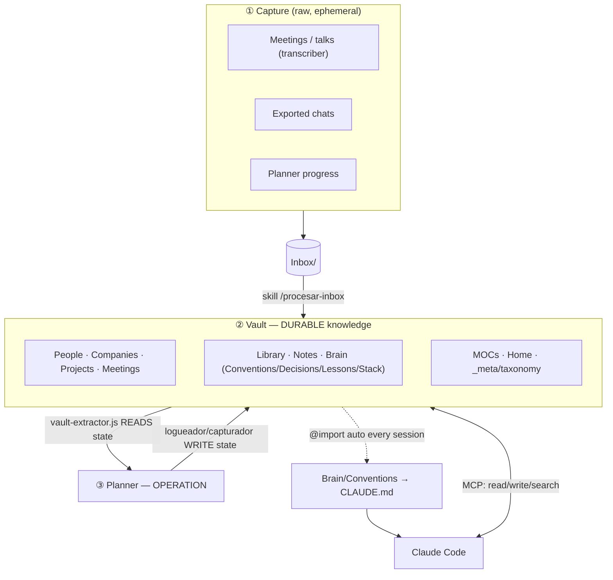
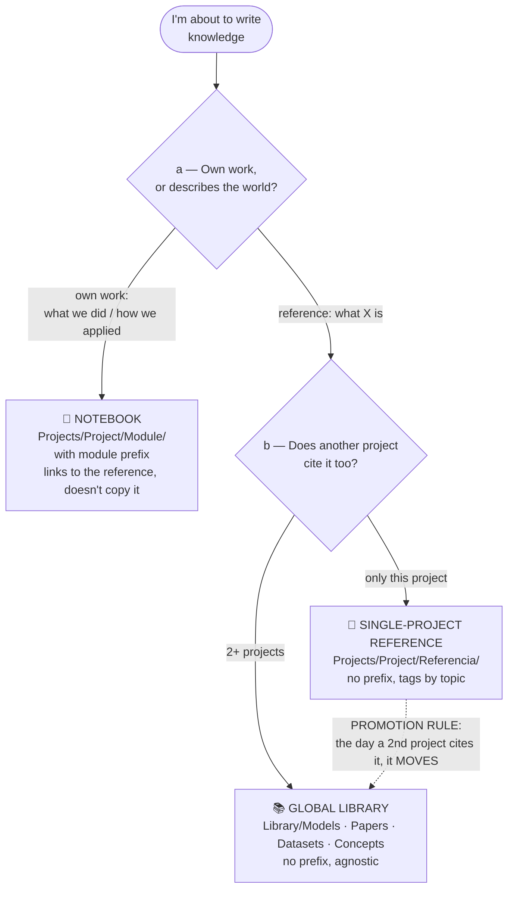
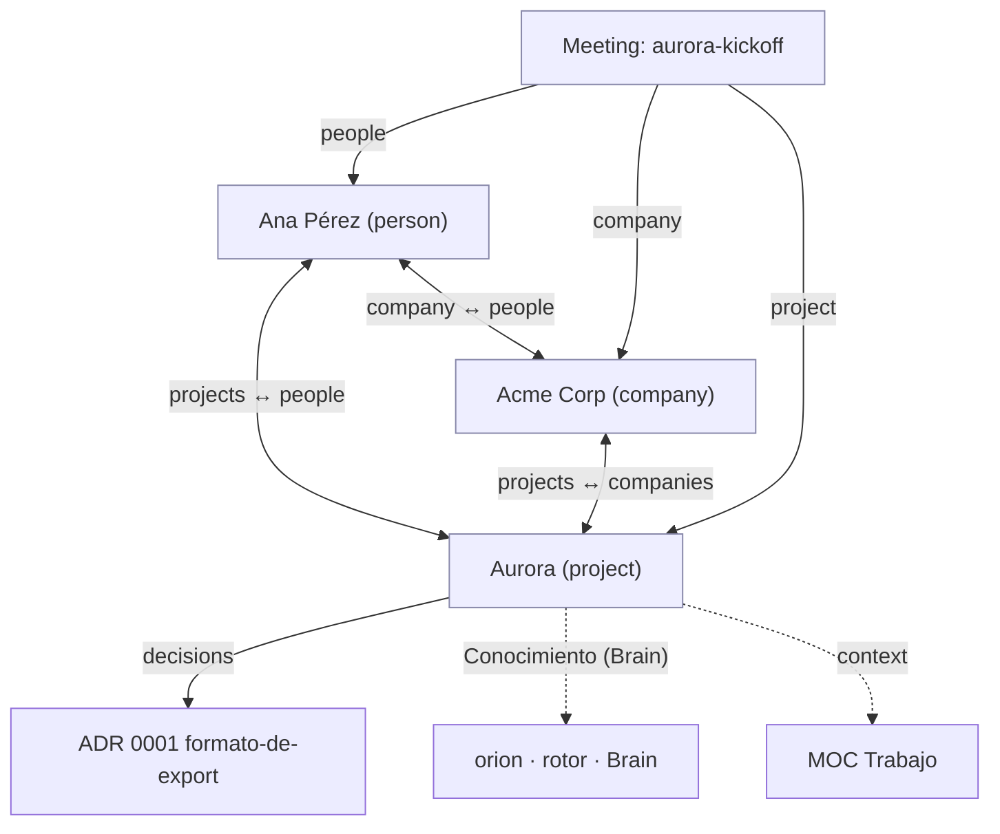
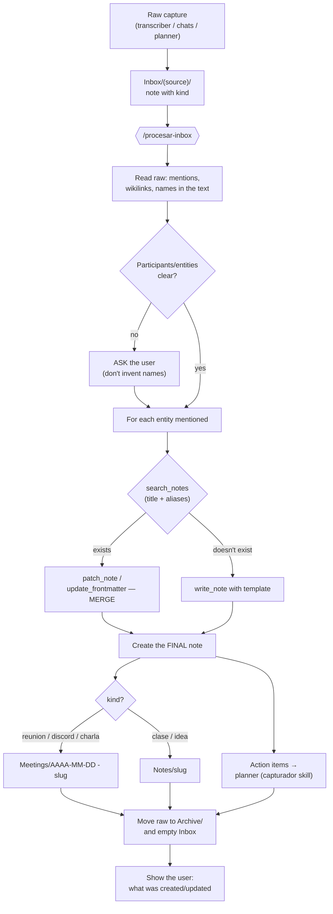
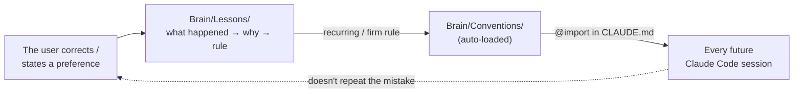
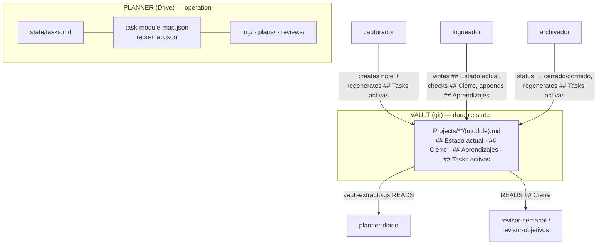
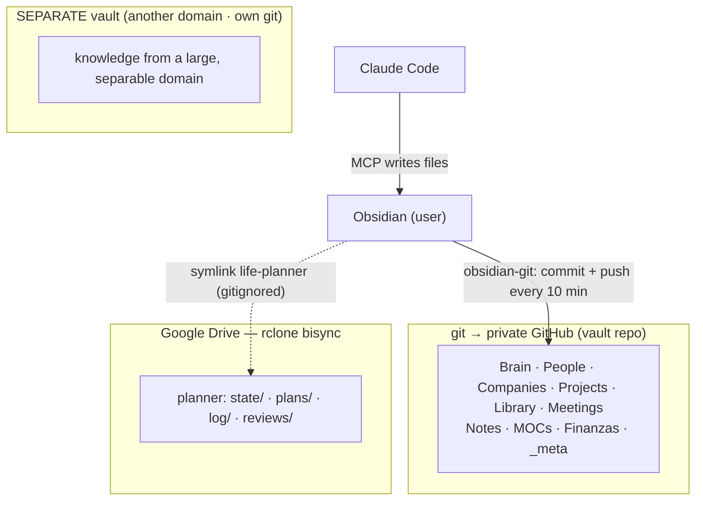

# 🧠 Second Brain — Guide

> Living documentation of **how this vault is built**: why it exists, what each part holds, how it connects to Claude Code and to the planner, and how it's maintained. The **technical contract** (schema) lives separately in [[taxonomy]]; this guide explains and contextualizes it.
>
> This is a guide to the **system**, not its contents. Every example uses an **invented cast** (nothing real from the vault), consistent end to end: people *Ana Pérez* and *Beto Díaz*; companies *Acme Corp* and *Globex*; program-project *Aurora* (modules *Backend* / *Datos* / *App*) and simple project *Faro*; models *orion* and *rotor*; dataset *atlas*.
>
> Note on names: the vault itself is run in Spanish, so real system identifiers stay literal — section names like `## Estado actual`, planner skills like `capturador`, and the closed vocabulary (`trabajo`, `cliente`, …). They're glossed in English the first time.

---

## Index

1. [Philosophy: why it exists and what model it follows](#1-philosophy-why-it-exists-and-what-model-it-follows)
2. [Bird's-eye view: architecture and directory tree](#2-birds-eye-view)
3. [The contract (schema): `taxonomy.md`](#3-the-contract-schema-taxonomymd)
4. [The three layers of technical knowledge](#4-the-three-layers-of-technical-knowledge)
5. [Folder-by-folder walkthrough](#5-folder-by-folder-walkthrough)
6. [The graph: the relationship web between entities](#6-the-graph-the-relationship-web-between-entities)
7. [Obsidian: plugins and what each one is for](#7-obsidian-plugins-and-what-each-one-is-for)
8. [Capture layer: from Inbox to entity](#8-capture-layer-from-inbox-to-entity)
9. [Claude Code integration (MCP + skill + Conventions)](#9-claude-code-integration)
10. [Planner integration](#10-planner-integration)
11. [Backup and sync](#11-backup-and-sync)
12. [End-to-end flows (walkthroughs)](#12-end-to-end-flows)
13. [Golden rules and what NOT to do](#13-golden-rules-and-what-not-to-do)
14. [Maintenance and vault hygiene](#14-maintenance-and-vault-hygiene)
15. [Quick glossary](#15-quick-glossary)

---

## 1. Philosophy: why it exists and what model it follows

The second brain is the **single knowledge hub**. It's plain Markdown inside an Obsidian vault, versioned in git → a private GitHub repo. Two clients read and write it: the human (from Obsidian) and Claude Code (via an MCP server). It's not a drawer of notes: it's a **graph database** made of text files, with an explicit schema.

The core idea is to separate **two natures of information** that most systems mix together — and rot because of it:

| | **Vault (knowledge)** | **Planner (operation)** |
|---|---|---|
| Holds | the **durable and connected** | the **operational** |
| Question it answers | *what do I know? who/what do I know?* | *what do I do today?* |
| Examples | people, companies, decisions, lessons, project state | today's tasks, plans, logs, reviews |
| Persistence | git (full history) | Google Drive (rclone) |
| Tempo | changes slowly, accumulates | changes daily, gets archived |

> **Golden rule of the system:** *organize by entity, let the links (the graph) do the work, and start simple.* Don't invent structure before you need it.

The model is **hub + adapters**: the vault is the center and connects to the world through two bridges.

- **In (capture):** what happens during the day (transcribed meetings, planner progress, chats) lands raw in `Inbox/`; a skill **distills** it into graph entities.
- **Out (extraction):** a script (`vault-extractor.js`) reads the state of projects so the planner and other apps can **plan better** without duplicating the information.



---

## 2. Bird's-eye view

Structure is **by entity type** (not by project, not by date). Each top-level folder is a class of thing; large projects sub-structure by module inside `Projects/`.

```text
~/second-brain/
├── Home.md                  ← entry point (index with Dataview views)
├── README.md                ← the model on one screen
│
├── _meta/                   ← the vault "schema"
│   ├── taxonomy.md          ← CONTRACT: types, frontmatter, closed vocabulary
│   ├── guide-second-brain.md ← (this document)
│   └── Attachments/         ← embedded images/files
│
├── People/                  ← 1 note per person (global across all contexts)
├── Companies/               ← companies and institutions
├── Projects/                ← projects/areas with state (the planner's entry point)
│   ├── <Program-project>/   ← large project: hub + one folder per module
│   │   ├── <project>.md      ← hub (type: project root)
│   │   ├── <Module-A>/  <Module-B>/  …   ← one folder per module (PascalCase)
│   │   └── Referencia/       ← single-project domain knowledge (Models/Papers/…)
│   └── <Simple-project>.md   ← small project: a single note
│
├── Meetings/                ← meetings, group work, talks (capture destination)
├── Library/                 ← REUSABLE knowledge, project-agnostic
│   ├── Models/  Papers/  Datasets/  Concepts/   (+ _index per sub-folder)
├── Notes/                   ← loose notes (classes, ideas not yet an entity)
│
├── Brain/                   ← PERSONAL technical knowledge (how the human builds)
│   ├── Conventions/         ← AUTO-LOADED into Claude every session (workflow/testing/stack/ml)
│   ├── Decisions/           ← ADRs (architecture decisions, immutable)
│   ├── Lessons/             ← postmortems (what happened → why → rule)
│   └── Stack/               ← one note per technology (loaded on-demand)
│
├── MOCs/                    ← Maps of Content: Trabajo · Estudio · Vida (Work · Study · Life)
├── Inbox/                   ← RAW capture → processed and emptied
│   └── <source>/            ← one sub-folder per capture source
├── Archive/                 ← raw already processed (the source is never deleted)
├── Finanzas/                ← own-domain folder (e.g. periodic reports)
├── Templates/               ← Templater templates (person, company, project, adr, meeting, note)
│
├── life-planner →  ~/code/<planner>    (SYMLINK, gitignored)
├── .obsidian/               ← Obsidian config + plugins (partly gitignored)
└── .gitignore
```

**Three ideas for reading this tree:**

1. **The graph entities** (`People`, `Companies`, `Projects`, `Meetings`) are the "nouns".
2. **Knowledge** is split across three reuse levels (`Library` global, `Referencia` single-project, and the notebook inside each module) + the personal stuff in `Brain`.
3. **Navigation** comes from `Home`, the `MOCs`, and the wikilinks; nothing is organized "by hand" in deep folders — the graph does the work.

---

## 3. The contract (schema): `taxonomy.md`

`_meta/taxonomy.md` is **the most important file in the vault**. It defines the vocabulary and rules that both the human and any writing skill (Claude included) must respect. Claude reads it *before* creating or editing a note. Think of it as the system's `schema.sql`.

### 3.1 The schema's golden rules

1. **One entity = one note.** Before creating, search by title + `aliases`. If it exists → **merge, don't duplicate.** (Avoids ending up with "Ana Pérez", "ana perez" and "A. Pérez" as three different people.)
2. **`summary` is mandatory** on every note (1-2 sentences). It's what lets you **preview without opening the file** → it directly controls the agent's context cost. Without `summary` the agent has to read the whole note just to know whether it's useful.
3. **On a contradiction between sources, flag it explicitly** inside the note. Don't silently overwrite.
4. **Relationships via wikilink in the frontmatter** (`company: "[[Acme Corp]]"`). Views (tables, lists) are derived from backlinks + Dataview, never hand-edited.
5. **The Inbox is raw:** it gets processed and emptied. The source isn't deleted until its content is promoted.
6. **Three knowledge layers** with an explicit decision tree (see §4).

### 3.2 Note types (`type`)

**Closed** vocabulary of types: `person` · `company` · `project` · `meeting` · `note` · `model` · `concept` · `adr` · `lesson` · `resource` · `moc` · `meta`.

### 3.3 Closed vocabulary (enums)

No values are invented outside these lists — that's what keeps Dataview views consistent:

- **`status`**: `active` · `dormido` (dormant) · `cerrado` (closed) · `archived`
- **`context`**: `trabajo` (work) · `estudio` (study) · `vida` (life) — can be a list if an entity crosses contexts
- **`company.relationship`**: `cliente` · `partner` · `competidor` · `institucion` · `proveedor` · `infra` · `prospecto`
- **`person.roles`**: `cliente` · `colega` · `stakeholder-cientifico` · `integrador` · `empleado` · `profesor` · `companero` · `inversor` · `contacto`
- **`meeting.kind`**: `reunion-laburo` · `discord-tp` · `charla-evento` · `clase` · `personal-idea`

### 3.4 Frontmatter by type (summary)

Each type has a canonical frontmatter (the exact detail is in [[taxonomy]] and in `Templates/`). Notice how the `company` / `people` / `projects` / `companies` fields are the ones that **weave the relationship web** between entities (see §6):

| Type | Key frontmatter fields | Fixed body sections |
|---|---|---|
| **person** | `aliases[]`, `company "[[ ]]"`, `roles[]`, `projects[]`, `context[]`, `org`, `email`, `last-contact`, `summary` | `## Notas`, `## Interacciones` (Dataview) |
| **company** | `aliases[]`, `website`, `industry`, `relationship[]`, `people[]`, `projects[]`, `context[]`, `status`, `summary` | `## Contexto`, `## Personas`, `## Proyectos` (Dataview) |
| **project** | `status`, `context`, `module` (planner slug), `repos[]`, `people[]`, `companies[]`, `decisions[]`, `summary` | `## Estado actual` · `## Cierre` · `## Aprendizajes` · `## Conocimiento (Brain)` · `## Tasks activas` |
| **meeting** | `kind`, `date`, `people[]`, `project "[[ ]]"`, `company "[[ ]]"`, `context`, `summary` | `## TL;DR` · `## Decisiones` · `## Action items` · `## Notas` · `## Conexiones` |
| **adr** | `id`, `status`, `date`, `project "[[ ]]"`, `supersedes`, `superseded-by`, `summary` | `## Contexto` · `## Decisión` ("We will…") · `## Alternativas` · `## Consecuencias` |
| **note** | `context`, `source`, `summary` | free + `## Conexiones` |
| **lesson** | `date`, `rule`, `area`, `summary` | what happened → why → rule |
| **model** | `family`, `learning`, `aliases[]`, `ref`, `domain`, `summary` | what it is + how I use it + where |
| **concept** | `domain`, `aliases[]`, `ref`, `summary` | free |
| **resource** | `kind(paper\|dataset\|snippet\|link)`, `url`, `topic`, `domain`, `summary` | free |

(Project sections, glossed: `## Estado actual` = current state · `## Cierre` = closing checklist · `## Aprendizajes` = learnings · `## Conocimiento (Brain)` = knowledge links · `## Tasks activas` = active tasks.)

### 3.5 File naming (key so nothing breaks)

- **Entities** (person/company/project): **readable title** → `Ana Pérez.md`, `Acme Corp.md`, `Aurora.md`.
- **Time-based** (meeting, capture): **ISO prefix** → `2026-02-10 - aurora-kickoff.md`.
- **ADR / loose concepts**: **kebab-case** → `Brain/Decisions/0001-formato-de-export.md`.
- **Library and Referencia** (model/paper/dataset/concept): **kebab by canonical name, no prefix** → `Library/Models/orion.md`. The module prefix (`<mod>-*`, e.g. `datos-*`) is reserved for the **notebook**.

> ⚠️ **`module` slug = file basename.** The planner's extractor identifies a project note by its file name, not its folder. That's why **moving a note into a subfolder is safe** (Obsidian wikilinks resolve by name, not path), but **renaming the file is NOT**: it breaks the `[[wikilinks]]` and the `module ↔ repo ↔ task` link with the planner.

---

## 4. The three layers of technical knowledge

This is the vault's subtlest rule (rule 6 of [[taxonomy]]) and the one that keeps `Library/` from becoming a dumping ground. Before writing knowledge, ask **two separate questions**:

- **(a) Nature:** does the note describe something in the world that exists *independently of the project* (*"what X is"*), or is it your own work/state/decision (*"what we did / how we applied X"*)?
- **(b) Reuse:** if it's *"what X is"*, would **some project other than the current one** cite it, or **only this one**?



**How it looks in practice:**

- **Notebook** → `Projects/Aurora/Datos/datos-notas.md` (config, numbers and state of the actual work in Aurora).
- **Single-project reference** → `Projects/Aurora/Referencia/Models/rotor.md` (what *rotor* is; today only Aurora uses it).
- **Global Library** → `Library/Models/orion.md` (what *orion* is; cited by Aurora *and* Faro → already promoted).

> **The mistake to avoid:** putting something in `Library/` just because "it exists in the world". If only one project still uses it, it goes in `Referencia/`. The promotion rule is the same as `Lessons → Conventions`: **born local, promoted when reuse materializes**, not before. Don't guess the future.

A program-project's `Referencia/` folder **mirrors the structure of `Library/`** (`Models/`, `Papers/`, `Datasets/`, `Concepts/`, `Standards/`, `Tools/`) so promoting a note is literally a `mv` with no reorganizing.

---

## 5. Folder-by-folder walkthrough

### 5.1 `People/` — people (one global note per person)

One note per person, **unique even across contexts** (a client who's also a friend is a single note with `context: [trabajo, vida]`). The file name is the readable name.

Typical frontmatter (invented example, *Ana Pérez*):

```yaml
type: person
aliases: ["Ana P.", "ana perez"]
company: "[[Acme Corp]]"          # ← person → company relation
roles: [cliente, stakeholder-cientifico]
projects: ["[[Aurora]]"]           # ← person → project relation
context: [trabajo]
org: "Acme Corp — Data team"
last-contact: 2026-02-10
summary: "Aurora's sponsor at Acme Corp; sets requirements and signs off deliverables."
tags: [person]
```

The body isn't a data dump: it's **why this person matters** and the context the agent needs to resume the relationship without re-researching (what was discussed, what's owed, what they decided). *Ana*'s note, for example, would hold her open requests, what she approved, and what's still pending with her.

The `## Interacciones` section is an **automatic Dataview view** listing every `meeting` where the person appears in `people[]` — not maintained by hand.

### 5.2 `Companies/` — companies and institutions

Companies, clients, competitors, institutions. Frontmatter with `relationship[]` (from the closed vocabulary), `people[]` and `projects[]` by wikilink. The body works as **living memory** of the relationship (deal state, budget, players, next steps) that survives between meetings.

Invented example (*Acme Corp*), showing the **return side** of Ana's and Aurora's links:

```yaml
type: company
relationship: [cliente]
people: ["[[Ana Pérez]]", "[[Beto Díaz]]"]   # ← company → people
projects: ["[[Aurora]]"]                       # ← company → projects
context: [trabajo]
status: active
summary: "Anchor client for Aurora; sponsor on the Data side."
tags: [company]
```

The `## Personas` and `## Proyectos` sections are Dataview: they automatically list every person whose `company` points to *Acme Corp*, and every project that has it in `companies[]`.

### 5.3 `Projects/` — projects/areas with state (the planner's entry point!)

It's the richest folder and the **only one the planner reads and writes**. A project note connects the work to **the people and companies involved** (`people[]`, e.g. *Ana Pérez*, and `companies[]`, e.g. *Acme Corp*), to **its decisions** (`decisions[]` → ADRs), and to **the technical knowledge** (`## Conocimiento (Brain)`). Two shapes:

**(a) Simple project** → a single note at `Projects/Faro.md`.

**(b) Program-project** (several modules, e.g. *Aurora*) → it sub-structures:

```text
Projects/Aurora/
├── aurora.md                 ← the HUB (type: project root; lists modules, people, companies)
├── Datos/
│   ├── aurora-datos.md       ← module note (type: project, module: aurora-datos)
│   ├── datos-notas.md        ← notebook (module prefix): config, work decisions
│   ├── datos-experimentos.md ← notebook: comparison with numbers
│   └── datos-bitacora.md     ← notebook: problems, fixes, state
├── Backend/ · App/           ← one folder per module (PascalCase)
└── Referencia/               ← single-project domain knowledge (Models/Papers/Datasets/…)
```

The **fixed sections** of every project note are the contract with the planner:

- **`## Estado actual`** (current state) — live snapshot, no dates. Maintained by the planner's *logueador*.
- **`## Cierre`** (closing) — checklist of the minimum needed to close. The planner reads it to prioritize toward closing, not toward features (anti scope-creep). **Don't inflate it with anything beyond the minimum.**
- **`## Aprendizajes`** (learnings) — append-only, high-signal only. Promoted to `Brain/Lessons` or to an ADR.
- **`## Conocimiento (Brain)`** — *one-way* links to `Brain/` and to `Library/`.
- **`## Tasks activas`** (active tasks) — a view derived from the planner's `state/tasks.md`. **Don't hand-edit.**

> The frontmatter `module:` is the **glue** between vault and planner: it links `task ↔ project note ↔ repo`. See §10.

### 5.4 `Meetings/` — meetings, group work, talks (capture destination)

One note per interaction, named with an ISO prefix (e.g. `2026-02-10 - aurora-kickoff.md`). It's the **main destination of processed captures**. Structure: `## TL;DR`, `## Decisiones`, `## Action items` (checkboxes), `## Notas`, `## Quotes`, `## Conexiones`. The frontmatter links to `people[]`, `project` and `company`, so the meeting appears automatically in each person's `## Interacciones` view and in the project's graph. A meeting is the node that **connects people, company and project in one shot**.

### 5.5 `Library/` — reusable, project-agnostic knowledge

What **exists independently of a project** and more than one can cite. Four sub-folders, each with its `_index.md` (a MOC that is both explanation and Dataview view):

- **`Models/`** — models/architectures/algorithms. Classified by `family` (classic-ml / deep-nn / process-based / hybrid) × `learning` (supervised / self-supervised / …). Each note: *what it is + how I prefer to use it + where I use it*. The concrete config and results live in the project notebook, **not here**.
- **`Papers/`** — papers (`kind: paper`, with `year`, `domain`).
- **`Datasets/`** — data sources (`kind: dataset`); the `_index` carries a "what it is / when / gotcha" table.
- **`Concepts/`** — reusable domain concepts.

Each sub-folder's `_index.md` isn't decorative: it combines a **hand-curated table** (to decide without opening each note) with a **Dataview view** that fills itself.

### 5.6 `Notes/` — loose notes

Atomic knowledge that isn't a library entity yet: a class, a talk, an idea. If a loose note matures and a project starts citing it, it gets promoted to `Library/` or to a `Referencia/`.

### 5.7 `Brain/` — personal technical knowledge

How the human builds, split into four:

- **`Conventions/`** — **auto-loaded into Claude every session** (via `~/.claude/CLAUDE.md`). These are the working rules (`workflow.md`, `testing.md`, `stack.md`, `ml.md`…), tied together by `_index.md`. That's why it's kept **short and high-signal**: every line costs tokens in *all* sessions.
- **`Decisions/`** — ADRs (Architecture Decision Records). Forward-looking and **immutable**: they document *why* something was chosen. If the decision changes, a **new** ADR is created and marked `superseded-by`; the old one isn't edited.
- **`Lessons/`** — retrospective postmortems: **what happened → why → the rule**. When a lesson recurs, it's **promoted** to `Conventions/`.
- **`Stack/`** — one note per technology (loaded on-demand when working with that technology).

> **ADR ≠ Lesson:** the ADR is prospective ("we'll do X because…"), the Lesson is retrospective ("we learned Y when something went wrong"). The Lesson *links* to the ADR, it doesn't replace it.

### 5.8 `MOCs/` — Maps of Content

Three maps by **life context**: [[Trabajo]], [[Estudio]], [[Vida]] (Work, Study, Life). Each is almost pure Dataview: it lists the projects, companies and people of that context. They're the "cover page" of each area. When a domain grows large and is separable (e.g. academic material from a whole degree), it's better moved to a **separate vault**, leaving only the *in-progress* stuff here (see §11).

### 5.9 `Inbox/`, `Archive/`, `Finanzas/`, `Templates/`, `_meta/`

- **`Inbox/`** — raw capture, one sub-folder per source (`Inbox/<source>/`). Gets processed and **emptied**.
- **`Archive/`** — the raw already processed (the original source isn't deleted; it's moved here).
- **`Finanzas/`** — own-domain folder: periodic reports (e.g. quarterly). It lives in the vault because it's durable knowledge; it's an example of a **domain folder** outside the graph entities.
- **`Templates/`** — Templater templates (`person`, `company`, `project`, `adr`, `meeting`, `note`): they start a note with the right frontmatter and fixed sections.
- **`_meta/`** — the schema ([[taxonomy]]), this guide, and `Attachments/`.

---

## 6. The graph: the relationship web between entities

The vault **isn't navigated by folders**, it's navigated by the graph. Three mechanisms:

1. **Wikilinks in the frontmatter** (`company: "[[Acme Corp]]"`, `people: ["[[Ana Pérez]]"]`). They create **typed** edges between entities. In Obsidian they resolve by **file name**, not path → which is why moving files between folders is safe.
2. **Dataview** — SQL-like queries embedded in notes that produce live tables/lists (e.g., in `Home`: *all active projects by context*). Views are never hand-edited; they derive from the frontmatter.
3. **MOCs + backlinks** — the `MOCs/` and `Home` are the curated entry points; Obsidian's **backlinks** give reverse navigation for free (who points at this note).

### The relationship web (the important part)

Entities reference each other **in both directions**: a Project lists its people and companies; those people list their company and their projects; that company lists its people and projects. It's a **reciprocal mesh**, not a tree. A Meeting, on top, touches all three at once. Solid lines = a link stored in the frontmatter; dotted lines = a view derived by Dataview (the link's "return trip").

The example: *Ana Pérez* works at *Acme Corp*, both connected to project *Aurora*; the *aurora-kickoff* meeting touches all three; *Aurora* points to its decision and to its technical knowledge.



**How to read it (with the example):**

- **Ana ↔ Acme Corp:** *Ana* declares her `company: "[[Acme Corp]]"`; *Acme Corp* lists her in `people[]` (and its `## Personas` section shows her automatically).
- **Ana ↔ Aurora:** *Ana* declares `projects: ["[[Aurora]]"]`; *Aurora* lists her in `people[]`.
- **Acme Corp ↔ Aurora:** *Acme Corp* declares `projects: ["[[Aurora]]"]`; *Aurora* lists it in `companies[]` (and its `## Proyectos` section shows it on its own).
- **Meeting → everything:** *aurora-kickoff* links *Ana*, *Acme Corp* and *Aurora* at once, and shows up in each one's `## Interacciones` view — without touching anything by hand.
- **Project → knowledge:** *Aurora* points to its decision (ADR 0001) and to its technical notes (*orion*, *rotor*, `Brain/`), and to its context MOC (*Trabajo*).

> Result: pull on any node and you bring the whole context attached. That's why "one entity = one note" and "relationships via wikilink" are the two rules that hold the system up.

---

## 7. Obsidian: plugins and what each one is for

The vault uses these community plugins (in `.obsidian/community-plugins.json`):

| Plugin | What for | Relevant config |
|---|---|---|
| **dataview** | Live views (tables/lists) from the frontmatter. The engine behind `Home`, MOCs and `_index`. | — |
| **templater-obsidian** | Templates with logic (auto date, file title). | `Templates/` folder |
| **obsidian-tasks-plugin** | Query and manage `- [ ]` checkboxes across the vault (action items, closings). | — |
| **quickadd** | Shortcuts to create new notes with the right template in one tap. | — |
| **calendar** + **periodic-notes** | Calendar view and daily notes (`Daily/`, format `YYYY-MM-DD`). | template `Templates/daily` |
| **obsidian-git** | **Automatic backup**: commit + push to GitHub. | `autoSaveInterval: 10`, `autoPushInterval: 10`, `autoPullOnBoot: true`, `pullBeforePush: true` |

> **obsidian-git** is the safety net: every **10 minutes** it does `commit` + `push` with message `vault backup: {{date}}`, and `pull` when Obsidian opens. That's why the git history is full of "vault backup: …" commits. UI state (`workspace.json`, `cache`) is gitignored so it doesn't pollute cross-device sync.

---

## 8. Capture layer: from Inbox to entity

The `Inbox/` is the raw inbox, with **one sub-folder per capture source**. Typically:

- **`Inbox/<transcriber>/`** — meetings, group work, talks, classes and voice notes transcribed by a capture skill. Each capture arrives already classified with a `kind` (from the `meeting.kind` vocabulary).
- **`Inbox/<chats>/`** — messaging/chats exported to Markdown.
- **`Inbox/planner/`** — progress coming from the planner side.

Processing is done by the **`second-brain`** skill (command `/procesar-inbox`). The flow:



**Key processing decisions:**

- **Search before creating** (the "one entity = one note" rule): always `search_notes` by title + `aliases` and **merge** if it exists.
- **Don't invent names:** if who participated isn't clear, ask.
- **Action items are NOT written into the vault as tasks** — they go to the **planner** via the `capturador` skill. The vault holds the meeting; the planner, the tasks that came out of it.
- **Raw is archived, not deleted** (rule 5 of the schema).

---

## 9. Claude Code integration

Claude doesn't "see" the vault by accident: there are three deliberate mechanisms.

### 9.1 The vault MCP

An MCP server **exposes the vault as tools**. Config (in `~/.claude.json`):

```json
"second-brain": {
  "type": "stdio",
  "command": "npx",
  "args": ["-y", "<an-obsidian-vault-mcp-server>", "~/second-brain"],
  "env": {}
}
```

Tools it exposes (the ones starting with `mcp__second-brain__`):

| Category | Tools |
|---|---|
| Read | `read_note`, `read_multiple_notes`, `get_frontmatter`, `get_notes_info`, `get_vault_stats` |
| Write | `write_note`, `patch_note`, `update_frontmatter` (modes: overwrite / append / prepend) |
| Move | `move_note`, `move_file` |
| Search | `search_notes` (BM25 ranking) |
| List | `list_directory`, `list_all_tags` |
| Tags / delete | `manage_tags`, `delete_note` (asks for confirmation) |

The cheap read pattern is **`search_notes` → preview the `summary` (`get_frontmatter`) → `read_note`** only if the full body is needed. That's why the mandatory `summary` matters so much.

### 9.2 The `second-brain` skill

The skill (in `~/.claude/skills/second-brain/`) teaches Claude **how** to maintain the vault: read [[taxonomy]] before writing, search before creating, use wikilinks in the frontmatter, process the Inbox (`/procesar-inbox`), and respect the boundary with the planner (action items → `capturador`).

### 9.3 Conventions auto-load + the learning contract

`~/.claude/CLAUDE.md` does an `@import` of `Brain/Conventions/_index.md`, which in turn imports the convention notes. Result: **in every Claude Code session the conventions are already in context** without having to repeat them.

The **learning contract** closes the loop: when the user corrects Claude or states a preference, Claude writes/updates the matching note in `Brain/` (a `Lesson`, or directly a rule in `Conventions/`). A recurring lesson is **promoted** to `Conventions/`. That way the system improves itself and the same correction isn't repeated twice.



---

## 10. Planner integration

The vault and the planner are **two repos** that talk to each other. The vault holds the **durable state** of each project; the planner, the **operation** (tasks, plans, logs). The glue is the `module` slug.

### 10.1 The glue: `module ↔ repo ↔ task`

- **`module`** (project note frontmatter) = **file basename** = the slug everything references.
- **`state/task-module-map.json`** (planner): maps `task_id → module`. E.g.: `"<task-id>": "<module>"`.
- **`state/repo-map.json`** (planner): maps `repo in ~/code → task_id + module`. E.g.: `"<repo>": { "module": "<module>" }`. Used by a git scan to propose logs from commits.
- **`state/tasks.md`** (planner): tasks in two levels `## Theme → ### Module`; the `### Module` matches the note's `module`.

### 10.2 The extractor: `viewer/vault-extractor.js`

It's the **only read translator** from the vault to the planner. It walks `Projects/**` **recursively**, identifies the note by `basename == module slug` (robust to folder changes), and parses frontmatter + sections. `extractModuleState(slug)` returns an object with `status`, `summary`, `estado_actual`, `cierre` (as a checklist `[{done, text}]`), `cierre_pendiente`/`cierre_total`, `aprendizajes`, `people`, `companies`, `repos`. That's why **renaming the file breaks everything** but **moving folders doesn't**.

### 10.3 Who reads and who writes



| Planner skill | Reads from the vault | Writes to the vault |
|---|---|---|
| **capturador** | — | creates `Projects/**/<module>.md`; regenerates `## Tasks activas` |
| **logueador** | `extractModuleState` | overwrites `## Estado actual`, checks `## Cierre [x]`, appends to `## Aprendizajes` |
| **archivador** | tasks/log | regenerates `## Tasks activas`, changes `status` (`cerrado` if `## Cierre` complete, else `dormido`) |
| **planner-diario** | `## Cierre`, `cierre_pendiente` | — (read-only) |
| **revisor-semanal / -objetivos** | `## Cierre`, `## Estado actual` | — (read-only) |

> **One-way:** no planner skill touches `Brain/Conventions/`. Links `Projects/ → Brain/` go one direction.

### 10.4 The symlink and the data boundary

`~/second-brain/life-planner` is a **symlink** to the planner repo so it can be browsed from Obsidian. But it's **gitignored in the vault**: the planner's data (`state/`, `plans/`, `log/`, `reviews/`) does **not** enter the vault's git — it travels via **Google Drive (rclone)**. The planner, in turn, gitignores that same data (only the planner's code goes to its own git).

---

## 11. Backup and sync

Three persistence planes, each for a different thing:



- **Vault → git/GitHub:** all durable knowledge. Automatic backup every 10 min via obsidian-git (`pull` on open, periodic `commit`+`push`). Full history, private.
- **Planner → Google Drive (rclone):** the operational data. `drive-sync.sh pull` when starting to plan, `push` when done. **Not** in git (neither the vault's nor the planner's).
- **Separate vault:** when a domain grows large and is separable, it lives in **its own repo and its own graph** so it doesn't pollute the second brain's graph. That context's MOC explains it and leaves only the *in-progress* stuff in the second brain.

**What lives where (summary):**

| Content | vault git | Drive | separate-vault git |
|---|:--:|:--:|:--:|
| People, Companies, Projects (notes + state), Library, Brain, Meetings, MOCs, Finanzas | ✅ | — | — |
| Tasks, daily plans, logs, planner reviews | — | ✅ | — |
| Knowledge from a large, separable domain | — | — | ✅ |

---

## 12. End-to-end flows

### 12.1 Process a recorded meeting (*Aurora* kickoff)

1. The transcriber → a capture skill drops the raw note in `Inbox/<source>/` with its `kind`.
2. Run `/procesar-inbox`. Claude reads the raw, identifies *Ana Pérez*, *Acme Corp* and *Aurora* (asks if anything is unclear).
3. For each entity: `search_notes` → if it exists, `patch_note` (merge); if not, `write_note` with template.
4. Creates the final note `Meetings/2026-02-10 - aurora-kickoff.md` with `## TL;DR`, `## Decisiones`, `## Action items` (and `people: [Ana Pérez], company: [Acme Corp], project: [Aurora]`).
5. The action items go to the **planner** (`capturador`), not the vault.
6. Moves the raw to `Archive/` and shows what was created/updated.

### 12.2 Capture and close a task

1. `/capturar "add CSV export to Aurora's Datos module"` → the `capturador` adds the task to `state/tasks.md` under `### Datos` and **creates/updates** the project note `Projects/Aurora/Datos/aurora-datos.md` (regenerates `## Tasks activas`).
2. `/plan-hoy` → the `planner-diario` reads `## Cierre` of *Aurora · Datos* via the extractor and prioritizes toward the minimum.
3. `/log "2h, done"` → the `logueador` records `log/2026-02-12.json` and **updates the vault**: rewrites `## Estado actual`, checks the `## Cierre` item and, if there was a finding, appends it to `## Aprendizajes`.
4. When done: `drive-sync.sh push`. Obsidian, for its part, commits the vault on its own.

### 12.3 Record a decision (ADR) and a lesson

- **ADR** → `Brain/Decisions/0001-formato-de-export.md` with `## Contexto / ## Decisión ("We will…") / ## Alternativas / ## Consecuencias`. It's **immutable**: if it changes, a new ADR with `superseded-by`. Linked from *aurora-datos*'s `decisions[]`.
- **Lesson** → `Brain/Lessons/dont-assume-command-output.md` with *what happened → why → rule*. If recurring, promoted to `Conventions/`.

### 12.4 Promote a reference to `Library/`

*rotor* is born at `Projects/Aurora/Referencia/Models/rotor.md` (only Aurora uses it). The day *Faro* also cites it, it's **moved** (`mv`) to `Library/Models/rotor.md`. Since `Referencia/` mirrors the structure of `Library/` and wikilinks resolve by name, **nothing breaks**: only the folder changes.

---

## 13. Golden rules and what NOT to do

**Do:**

- ✅ One entity = one note. **Search before creating** (title + aliases) and merge.
- ✅ `summary` on **every** note (it's the cheap preview for the agent).
- ✅ Relationships via **wikilink in the frontmatter**; let Dataview generate the views.
- ✅ Start knowledge **local** (`Referencia/`) and promote it to `Library/` when reuse shows up.
- ✅ Keep `Brain/Conventions/` **short** (it loads every session, always costs tokens).

**Don't:**

- ❌ **Rename** a project note's file → breaks `[[wikilinks]]` and the `module ↔ task ↔ repo` mapping. (Moving folders is fine.)
- ❌ Put in `Library/` something only **one** project uses.
- ❌ Edit an already-accepted **ADR** → create a new one with `superseded-by`.
- ❌ Write **tasks** directly into the vault → they go to the planner (`capturador`).
- ❌ Hand-edit derived sections (`## Tasks activas`, Dataview views).
- ❌ Leave the `Inbox/` unprocessed (it's raw, empty it) or delete the source without archiving it.
- ❌ Silently overwrite contradictory information → flag the contradiction in the note.

---

## 14. Maintenance and vault hygiene

- **Process the Inbox** often (`/procesar-inbox`) so raw doesn't pile up.
- **Review `summary` and `tags`** when creating/editing — they're what makes the vault navigable and cheap.
- **Promote** recurring lessons (`Lessons → Conventions`) and references cited by 2+ projects (`Referencia → Library`).
- **Close projects**: when `## Cierre` is complete, the `archivador` marks them `cerrado`; inactive ones go to `dormido`.
- **Trust obsidian-git** for backup, but remember it's every 10 min: after a big change from Claude, a manual commit doesn't hurt.
- **Keep the graphs separate:** a large, separable domain goes to its own vault, not here.

---

## 15. Quick glossary

| Term | What it is |
|---|---|
| **Entity** | A graph "noun": person, company, project, meeting. One note each. |
| **Frontmatter** | The YAML block at the top of each note: type, relationships, summary, tags. |
| **`summary`** | Mandatory 1-2 sentence summary: cheap preview for the agent. |
| **Wikilink** | `[[Name]]` — a graph edge; resolves by file name, not path. |
| **MOC** | Map of Content: index note (Trabajo/Estudio/Vida) made with Dataview. |
| **Notebook (cuaderno)** | Own-work notes inside a module (`Projects/X/Mod/`, module prefix). |
| **Referencia** | "What X is" knowledge used today by **a single** project (`Projects/X/Referencia/`). |
| **Library** | "What X is" knowledge reusable by **2+** projects (`Library/`). |
| **ADR** | Architecture Decision Record: prospective, immutable decision (`Brain/Decisions/`). |
| **Lesson** | Retrospective postmortem (`Brain/Lessons/`): what happened → why → rule. |
| **`module`** | Slug = project-note basename; glues `task ↔ note ↔ repo` with the planner. |
| **Extractor** | `vault-extractor.js`: reads project state for the planner. |
| **Vault MCP** | The MCP server that gives Claude the vault's read/write/search tools. |

---

> **In one sentence:** the second brain is a flat-Markdown graph, governed by an explicit schema ([[taxonomy]]), that separates **durable knowledge** (git) from **operation** (planner/Drive), and that two agents — the human and Claude — keep alive under the contract of *one entity = one note, links that do the work, and start simple*.
